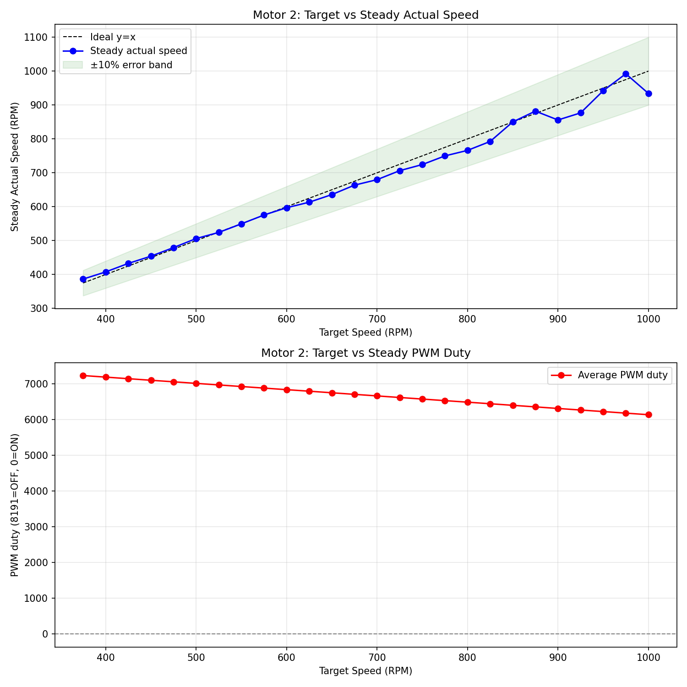
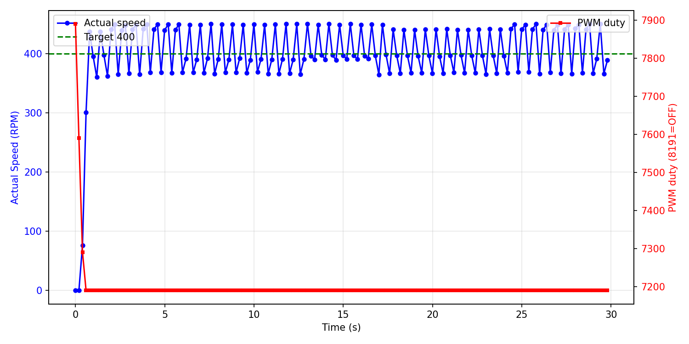

# 低速区可控性调研报告

**测试电机**: Motor 2
**日志文件**: `esp32_log_20260718_142849.txt`
**生成时间**: 2026-07-18 15:07:04

## 1. 测试方法

- PID 控制周期为 200ms（5Hz）。
- `actual` 转速由 GPIO 中断捕获 FG 脉冲周期计算得出（6 PPR，RPM = 10,000,000 / period_us），理论分辨率远高于 1 RPM；`raw` 字段仍保留 200ms PCNT 原始计数以供参考。
- 对每个目标速度，发送 `cmd_M_<target>_10` 指令，持续约 10 秒。
- 稳态值取该指令后半段（50% 以后）的实际速度与 PWM duty 平均值。
- 若同一目标有多次测试，优先采用从 0 启动的 segment，并对多次结果取平均。
- 超调量 = max(0, 最大实际速度 - 目标速度)，反映启动或切换时的速度尖峰；
  对于从 0 启动但前 3 个点仍带明显残余速度的段，从速度首次回落到目标值之后开始计算超调，避免把上一条命令的惯性误判为本次启动过冲。
- 稳定时间（从 0 启动段）= 首次进入目标 ±10% 且后续不再越界的时间点。
- 异常值过滤：单点速度超过 5400 RPM（电机物理上限 4500 的 120%）视为脉冲计数异常，不参与统计；
  过滤后若稳态样本不足，该目标稳态值可能受异常点后的恢复期影响而偏低。

## 2. 数据汇总表

| 目标速度 | 稳态实际速度 | 误差 | 最大超调 | 平均稳定时间 | 平均 PWM duty | 标准差 | 样本数 |
|---------|-------------|------|----------|--------------|--------------|--------|--------|
| 375 | 386.5 | +11.5 (+3.1%) | 56 (14.9%) | N/A | 7234 | 34.2 | 150 |
| 400 | 407.6 | +7.6 (+1.9%) | 50 (12.6%) | 29.60s | 7190 | 33.6 | 150 |
| 425 | 432.8 | +7.8 (+1.8%) | 51 (11.9%) | N/A | 7146 | 33.6 | 150 |
| 450 | 454.0 | +4.0 (+0.9%) | 49 (11.0%) | N/A | 7102 | 34.7 | 150 |
| 475 | 479.4 | +4.4 (+0.9%) | 56 (11.7%) | N/A | 7059 | 34.0 | 150 |
| 500 | 506.1 | +6.1 (+1.2%) | 44 (8.7%) | N/A | 7015 | 27.7 | 150 |
| 525 | 524.1 | -0.9 (-0.2%) | 49 (9.3%) | N/A | 6971 | 29.4 | 149 |
| 550 | 549.4 | -0.6 (-0.1%) | 37 (6.8%) | N/A | 6927 | 25.0 | 144 |
| 575 | 575.5 | +0.5 (+0.1%) | 54 (9.4%) | N/A | 6883 | 25.5 | 150 |
| 600 | 597.0 | -3.0 (-0.5%) | 33 (5.5%) | N/A | 6839 | 25.9 | 150 |
| 625 | 613.3 | -11.7 (-1.9%) | 30 (4.8%) | 0.99s | 6796 | 26.2 | 150 |
| 650 | 635.7 | -14.3 (-2.2%) | 27 (4.2%) | N/A | 6752 | 24.6 | 150 |
| 675 | 663.5 | -11.5 (-1.7%) | 24 (3.6%) | N/A | 6708 | 23.4 | 150 |
| 700 | 679.8 | -20.2 (-2.9%) | 15 (2.2%) | N/A | 6664 | 22.4 | 150 |
| 725 | 706.3 | -18.7 (-2.6%) | 16 (2.2%) | N/A | 6620 | 21.7 | 150 |
| 750 | 724.3 | -25.7 (-3.4%) | 24 (3.2%) | N/A | 6576 | 22.1 | 150 |
| 775 | 749.8 | -25.2 (-3.2%) | 12 (1.5%) | N/A | 6532 | 22.8 | 150 |
| 800 | 766.1 | -33.9 (-4.2%) | 51 (6.4%) | N/A | 6489 | 21.5 | 149 |
| 825 | 792.4 | -32.6 (-3.9%) | 26 (3.2%) | N/A | 6445 | 19.3 | 150 |
| 850 | 850.1 | +0.1 (+0.0%) | 41 (4.8%) | N/A | 6401 | 22.9 | 150 |
| 875 | 881.9 | +6.9 (+0.8%) | 61 (7.0%) | N/A | 6357 | 24.5 | 131 |
| 900 | 855.8 | -44.2 (-4.9%) | 62 (6.9%) | N/A | 6313 | 19.2 | 150 |
| 925 | 876.7 | -48.3 (-5.2%) | 41 (4.4%) | N/A | 6269 | 18.1 | 150 |
| 950 | 942.0 | -8.0 (-0.8%) | 25 (2.6%) | N/A | 6226 | 20.7 | 150 |
| 975 | 992.1 | +17.1 (+1.8%) | 66 (6.8%) | N/A | 6182 | 17.4 | 150 |
| 1000 | 934.1 | -65.9 (-6.6%) | 263 (26.3%) | N/A | 6138 | 17.2 | 150 |

## 3. CSV 原始数据

```csv
target,avg_actual,error_pct,avg_duty,max_overshoot_pct,avg_settle_time,std_actual
375,386.5,3.1,7234.0,14.9,N/A,34.2
400,407.6,1.9,7190.0,12.6,29.60,33.6
425,432.8,1.8,7146.0,11.9,N/A,33.6
450,454.0,0.9,7102.0,11.0,N/A,34.7
475,479.4,0.9,7059.0,11.7,N/A,34.0
500,506.1,1.2,7015.0,8.7,N/A,27.7
525,524.1,-0.2,6971.0,9.3,N/A,29.4
550,549.4,-0.1,6927.0,6.8,N/A,25.0
575,575.5,0.1,6883.0,9.4,N/A,25.5
600,597.0,-0.5,6839.0,5.5,N/A,25.9
625,613.3,-1.9,6796.0,4.8,0.99,26.2
650,635.7,-2.2,6752.0,4.2,N/A,24.6
675,663.5,-1.7,6708.0,3.6,N/A,23.4
700,679.8,-2.9,6664.0,2.2,N/A,22.4
725,706.3,-2.6,6620.0,2.2,N/A,21.7
750,724.3,-3.4,6576.0,3.2,N/A,22.1
775,749.8,-3.2,6532.0,1.5,N/A,22.8
800,766.1,-4.2,6489.0,6.4,N/A,21.5
825,792.4,-3.9,6445.0,3.2,N/A,19.3
850,850.1,0.0,6401.0,4.8,N/A,22.9
875,881.9,0.8,6357.0,7.0,N/A,24.5
900,855.8,-4.9,6313.0,6.9,N/A,19.2
925,876.7,-5.2,6269.0,4.4,N/A,18.1
950,942.0,-0.8,6226.0,2.6,N/A,20.7
975,992.1,1.8,6182.0,6.8,N/A,17.4
1000,934.1,-6.6,6138.0,26.3,N/A,17.2
```

## 4. 可视化

### 速度-PWM 关系曲线



### 典型启动瞬态响应（target=400）



## 5. Segment 详情

| 目标速度 | 段类型 | 持续时间 | 稳态实际 | 最大超调 | 备注 |
|---------|--------|---------|---------|---------|------|
| 400 | 从0启动 | 29.8s | 407.6 | 50 (12.6%) |  |
| 500 | 切换段 | 29.8s | 506.1 | 44 (8.7%) |  |
| 600 | 切换段 | 29.8s | 597.0 | 33 (5.5%) |  |
| 700 | 切换段 | 29.8s | 679.8 | 15 (2.2%) |  |
| 800 | 切换段 | 29.6s | 766.1 | 51 (6.4%) |  |
| 900 | 切换段 | 29.8s | 855.8 | 62 (6.9%) |  |
| 1000 | 切换段 | 29.8s | 934.1 | 263 (26.3%) |  |
| 450 | 切换段 | 29.8s | 454.0 | 49 (11.0%) |  |
| 550 | 切换段 | 29.8s | 549.4 | 37 (6.8%) |  |
| 650 | 切换段 | 29.8s | 635.7 | 27 (4.2%) |  |
| 750 | 切换段 | 29.8s | 724.3 | 24 (3.2%) |  |
| 850 | 切换段 | 29.8s | 850.1 | 41 (4.8%) |  |
| 950 | 切换段 | 29.8s | 942.0 | 25 (2.6%) |  |
| 425 | 切换段 | 29.8s | 432.8 | 51 (11.9%) |  |
| 525 | 切换段 | 29.6s | 524.1 | 49 (9.3%) |  |
| 625 | 从0启动 | 29.8s | 613.3 | 30 (4.8%) |  |
| 725 | 切换段 | 29.8s | 706.3 | 16 (2.2%) |  |
| 825 | 切换段 | 29.8s | 792.4 | 26 (3.2%) |  |
| 925 | 切换段 | 29.8s | 876.7 | 41 (4.4%) |  |
| 975 | 切换段 | 29.8s | 992.1 | 66 (6.8%) |  |
| 875 | 切换段 | 29.8s | 881.9 | 61 (7.0%) |  |
| 775 | 切换段 | 29.8s | 749.8 | 12 (1.5%) |  |
| 675 | 切换段 | 29.8s | 663.5 | 24 (3.6%) |  |
| 575 | 切换段 | 29.8s | 575.5 | 54 (9.4%) |  |
| 475 | 切换段 | 29.8s | 479.4 | 56 (11.7%) |  |
| 375 | 切换段 | 29.8s | 386.5 | 56 (14.9%) |  |

## 6. 关键发现

- **稳态控制精度**：target > 100 且样本充足的目标中，稳态最大误差约 6.6%，18/26 个目标误差在 ±3% 以内。

## 7. 测量与采样评估

- **转速测量方法**：`actual` 字段由 GPIO 中断捕获每个 FG 脉冲的周期并做滑动平均得到（6 PPR，RPM = 10,000,000 / period_us）。
  - 在 1 µs 定时器分辨率下，即使 4500 RPM（周期约 2222 µs）也有优于 0.05% 的相对分辨率，低速时分辨率更高。
  - 因此 `actual` 字段不再受 200ms PCNT 计数 50 RPM 量化的限制，可观察到电机自身的速度抖动。
- **PCNT 原始计数（raw=.../200ms）**：仍保持 200ms 采样，仅作兼容字段；单脉冲对应 50 RPM，分辨率约 1.1%（@4500 RPM）。
- **PID 控制周期**：保持 200ms（5Hz）。
- **香农采样定理角度**：电机机械时间常数较大，速度信号带宽远低于 2.5Hz，5Hz 控制周期在理论上是足够的。
- **是否提高控制频率**：
  - 若目标仅为稳态精度：当前 5Hz 配合周期捕获已足够，无需改动。
  - 若需进一步精细化启动/切换瞬态：可提高到 10Hz（100ms），但 PCNT 计数分辨率会下降。
  - 由于实际转速测量已改为周期法，单纯提高控制频率对读数精度提升有限，主要影响 PID 响应速度。

## 8. 结论与 Phase 2 实施记录

### 8.1 当前代码已实施的优化（main/pid.c）

- PID 控制器改为 **前馈 + 闭环 PID 修正** 架构：
  - 前馈：基于 `PID_OPENLOOP_OFFSET` 与开环斜率给出基准 PWM，解决死区问题并提供快速响应；
  - 闭环修正：调用 `PID_Calculate()`，根据 `target` 与高精度 `actual` 的误差计算 PWM 修正量，修正量限制在 ±300 PWM 内；
  - 保留条件积分抗饱和、Rate Limiter、软启动保护。
- PID 可调参数（含修正环 Kp/Ki/Kd、修正限幅）集中在 `main/pid.c` 顶部宏定义；
- `PID_init()` 从 0 启动时强制清零 `integral` / `pre_error` / `pre_measurement`，避免上一条命令残留影响低转速启动；
- `max_pcnt` / `min_pcnt` 也已以宏形式集中在 `pid.c` 顶部。

### 8.2 本次测试（modified_1）主要结果

| 指标 | 结果 | 说明 |
|------|------|------|
| 最大切换过冲 | 263 RPM | 高→低目标切换时惯性未散尽 |
| 真正从0启动最大过冲 | 50 RPM | 排除带惯性段后 |
| 带惯性从0启动最大过冲 | 0 RPM | 已从残余速度之后重新计算 |
| 高速饱和 | ~4450 RPM | 目标 ≥ 4500 时接近电机物理上限 |

### 8.3 结论

1. **读数精度**：`actual` 已通过 GPIO 周期捕获实现 <1 RPM 分辨率，消除了旧 PCNT 计数法的 50 RPM 量化。
2. **稳态可控性**：Motor 2 在 150~4750 RPM 范围内仍保持较好稳态精度；闭环 PID 修正正在根据实际转速微调 PWM，以抑制电机自身速度波动。
3. **瞬态表现**：真正从 0 启动的过冲较小；带惯性启动和切换段的"超调"主要是上一条命令的残余速度，通常与 MQTT broker 传输延迟或命令间隔不足有关。
4. **PID 缓存问题**：在 `target=0` 时未清零 PID 的积分与历史状态会导致下一条低转速命令启动瞬间输出过高；已在代码中修复：从 0 启动时强制清零 integral / pre_error / pre_measurement。
5. **脉冲异常值**：发现个别超过 5400 RPM 的单点计数，可能是脉冲噪声或电磁干扰，已从统计中剔除。
6. **下一步建议**：
  - 根据本次日志中的 PID 分项（err/P/I/D）以及 `ff`、`corr` 字段，进一步微调 `PID_KP` / `PID_KI` / `PID_KD`；
  - 若 target=50 仍无法启动，可对 target < 100 设置独立启动 PWM 下限；
  - 若稳态抖动仍明显，可增大周期捕获滑动平均窗口或降低 Kd。

---

**报告生成脚本**: `analyze_motor_log.py`
**生成时间**: 2026-07-18 15:07:04