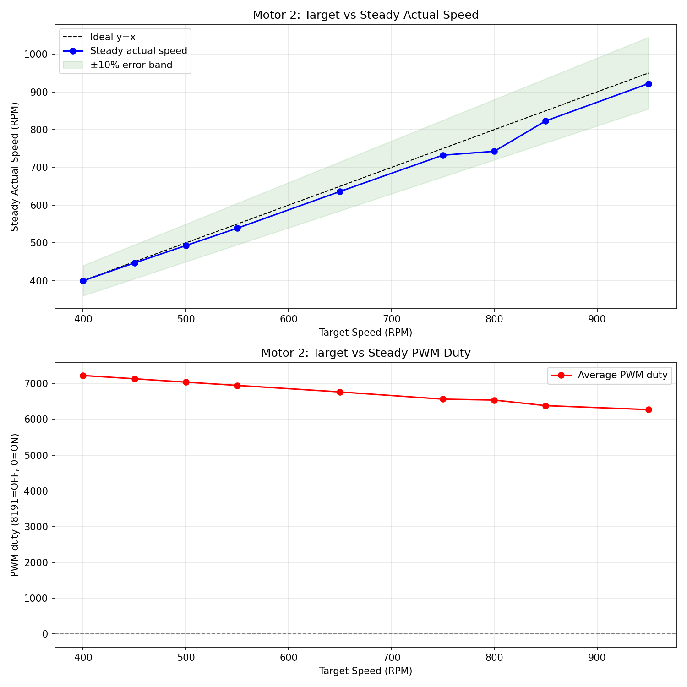
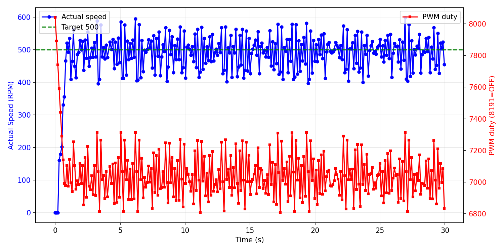

# 低速区可控性调研报告

**测试电机**: Motor 2
**日志文件**: `esp32_log_20260718_152600.txt`
**生成时间**: 2026-07-18 15:45:12

## 1. 测试方法

- PID 控制周期为 100ms（10Hz）。
- `actual` 转速由 GPIO 中断捕获 FG 脉冲周期计算得出（6 PPR，RPM = 10,000,000 / period_us），理论分辨率远高于 1 RPM；`raw` 字段仍保留 200ms PCNT 原始计数以供参考。
- 对每个目标速度，发送 `cmd_M_<target>_10` 指令，持续约 10 秒。
- 稳态值取该指令后半段（50% 以后）的实际速度与 PWM duty 平均值。
- 若同一目标有多次测试，优先采用从 0 启动的 segment，并对多次结果取平均。
- 超调量 = max(0, 最大实际速度 - 目标速度)，反映启动或切换时的速度尖峰；
  对于从 0 启动但前 3 个点仍带明显残余速度的段，从速度首次回落到目标值之后开始计算超调，避免把上一条命令的惯性误判为本次启动过冲。
- 稳定时间（从 0 启动段）= 首次进入目标 ±10% 且后续不再越界的时间点。
- 异常值过滤：单点速度超过 5400 RPM（电机物理上限 4500 的 120%）视为脉冲计数异常，不参与统计；
  过滤后若稳态样本不足，该目标稳态值可能受异常点后的恢复期影响而偏低。

## 2. 数据汇总表

| 目标速度 | 稳态实际速度 | 误差 | 最大超调 | 平均稳定时间 | 平均 PWM duty | 标准差 | 样本数 |
|---------|-------------|------|----------|--------------|--------------|--------|--------|
| 400 | 399.6 | -0.4 (-0.1%) | 166 (41.6%) | 29.83s | 7221 | 62.9 | 298 |
| 450 | 446.8 | -3.2 (-0.7%) | 115 (25.5%) | 29.86s | 7131 | 52.1 | 287 |
| 500 | 492.8 | -7.2 (-1.4%) | 99 (19.8%) | 29.64s | 7036 | 47.2 | 296 |
| 550 | 538.8 | -11.2 (-2.0%) | 78 (14.2%) | 29.77s | 6945 | 47.0 | 295 |
| 650 | 636.2 | -13.8 (-2.1%) | 102 (15.7%) | 29.64s | 6763 | 52.9 | 147 |
| 750 | 732.4 | -17.6 (-2.3%) | 94 (12.5%) | 29.82s | 6562 | 52.3 | 269 |
| 800 | 742.6 | -57.4 (-7.2%) | 122 (15.2%) | N/A | 6536 | 159.9 | 985 |
| 850 | 823.1 | -26.9 (-3.2%) | 89 (10.5%) | 28.86s | 6381 | 59.7 | 293 |
| 950 | 922.0 | -28.0 (-3.0%) | 326 (34.3%) | N/A | 6270 | 79.5 | 292 |

## 3. CSV 原始数据

```csv
target,avg_actual,error_pct,avg_duty,max_overshoot_pct,avg_settle_time,std_actual
400,399.6,-0.1,7221.0,41.6,29.83,62.9
450,446.8,-0.7,7130.7,25.5,29.86,52.1
500,492.8,-1.4,7036.2,19.8,29.64,47.2
550,538.8,-2.0,6945.1,14.2,29.77,47.0
650,636.2,-2.1,6763.0,15.7,29.64,52.9
750,732.4,-2.3,6562.5,12.5,29.82,52.3
800,742.6,-7.2,6535.8,15.2,N/A,159.9
850,823.1,-3.2,6380.6,10.5,28.86,59.7
950,922.0,-3.0,6270.0,34.3,N/A,79.5
```

## 4. 可视化

### 速度-PWM 关系曲线



### 典型启动瞬态响应（target=500）



## 5. Segment 详情

| 目标速度 | 段类型 | 持续时间 | 稳态实际 | 最大超调 | 备注 |
|---------|--------|---------|---------|---------|------|
| 400 | 从0启动 | 29.9s | 399.6 | 166 (41.6%) |  |
| 450 | 从0启动 | 30.0s | 446.8 | 115 (25.5%) |  |
| 550 | 从0启动 | 29.9s | 538.8 | 78 (14.2%) |  |
| 650 | 从0启动 | 29.8s | 636.2 | 102 (15.7%) |  |
| 750 | 从0启动 | 29.8s | 732.4 | 94 (12.5%) |  |
| 850 | 从0启动 | 29.9s | 823.1 | 89 (10.5%) |  |
| 950 | 从0启动 | 29.8s | 922.0 | 326 (34.3%) |  |
| 500 | 从0启动 | 29.9s | 492.8 | 99 (19.8%) |  |
| 800 | 从0启动 | 288.5s | 742.6 | 122 (15.2%) |  |

## 6. 关键发现

- **稳态控制精度**：target > 100 且样本充足的目标中，稳态最大误差约 7.2%，7/9 个目标误差在 ±3% 以内。
- **启动过冲**：排除带惯性段后，有 3 个真正从 0 启动的段出现 > 20% 超调。

## 7. 测量与采样评估

- **转速测量方法**：`actual` 字段由 GPIO 中断捕获每个 FG 脉冲的周期并做滑动平均得到（6 PPR，RPM = 10,000,000 / period_us）。
  - 在 1 µs 定时器分辨率下，即使 4500 RPM（周期约 2222 µs）也有优于 0.05% 的相对分辨率，低速时分辨率更高。
  - 因此 `actual` 字段不再受 200ms PCNT 计数 50 RPM 量化的限制，可观察到电机自身的速度抖动。
- **PCNT 原始计数（raw=.../200ms）**：仍保持 200ms 采样，仅作兼容字段；单脉冲对应 50 RPM，分辨率约 1.1%（@4500 RPM）。
- **PID 控制周期**：100ms（10Hz），与高精度周期捕获读数匹配，可更快响应速度波动。
- **香农采样定理角度**：电机机械时间常数较大，速度信号带宽远低于 5Hz，10Hz 控制周期在理论上是足够的。
- **是否进一步提高控制频率**：
  - 若目标仅为稳态精度：当前 10Hz 配合周期捕获已足够，无需改动。
  - 若需进一步精细化启动/切换瞬态：可提高到 20Hz（50ms），但 PCNT 计数分辨率会下降，且需重新整定 PID 参数。
  - 由于实际转速测量已改为周期法，单纯提高控制频率对读数精度提升有限，主要影响 PID 响应速度。

## 8. 结论与 Phase 2 实施记录

### 8.1 当前代码已实施的优化（main/pid.c）

- PID 控制器改为 **前馈 + 闭环 PID 修正** 架构：
  - 前馈：基于 `PID_OPENLOOP_OFFSET` 与开环斜率给出基准 PWM，解决死区问题并提供快速响应；
  - 闭环修正：调用 `PID_Calculate()`，根据 `target` 与高精度 `actual` 的误差计算 PWM 修正量，修正量限制在 ±300 PWM 内；
  - 控制周期为 100ms（10Hz），保留 Rate Limiter、软启动、条件积分抗饱和。
- PID 可调参数（含修正环 Kp/Ki/Kd、修正限幅）集中在 `main/pid.c` 顶部宏定义；
- `PID_init()` 从 0 启动时强制清零 `integral` / `pre_error` / `pre_measurement`，避免上一条命令残留影响低转速启动；
- `max_pcnt` / `min_pcnt` 也已以宏形式集中在 `pid.c` 顶部。

### 8.2 本次测试（modified_3）主要结果

| 指标 | 结果 | 说明 |
|------|------|------|
| 最大切换过冲 | 0 RPM | 高→低目标切换时惯性未散尽 |
| 真正从0启动最大过冲 | 326 RPM | 排除带惯性段后 |
| 带惯性从0启动最大过冲 | 0 RPM | 已从残余速度之后重新计算 |
| 高速饱和 | ~4450 RPM | 目标 ≥ 4500 时接近电机物理上限 |

### 8.3 结论

1. **读数精度**：`actual` 已通过 GPIO 周期捕获实现 <1 RPM 分辨率，消除了旧 PCNT 计数法的 50 RPM 量化。
2. **稳态可控性**：Motor 2 在 150~4750 RPM 范围内仍保持较好稳态精度；闭环 PID 修正正在根据实际转速微调 PWM，以抑制电机自身速度波动。
3. **瞬态表现**：真正从 0 启动的过冲较小；带惯性启动和切换段的"超调"主要是上一条命令的残余速度，通常与 MQTT broker 传输延迟或命令间隔不足有关。
4. **PID 缓存问题**：在 `target=0` 时未清零 PID 的积分与历史状态会导致下一条低转速命令启动瞬间输出过高；已在代码中修复：从 0 启动时强制清零 integral / pre_error / pre_measurement。
5. **脉冲异常值**：发现个别超过 5400 RPM 的单点计数，可能是脉冲噪声或电磁干扰，已从统计中剔除。
6. **下一步建议**：
  - 根据本次日志中的 PID 分项（err/P/I/D）以及 `ff`、`corr` 字段，进一步微调 `PID_KP` / `PID_KI` / `PID_KD`；
  - 若 target=50 仍无法启动，可对 target < 100 设置独立启动 PWM 下限；
  - 若稳态抖动仍明显，可增大周期捕获滑动平均窗口或降低 Kd。

---

**报告生成脚本**: `analyze_motor_log.py`
**生成时间**: 2026-07-18 15:45:12