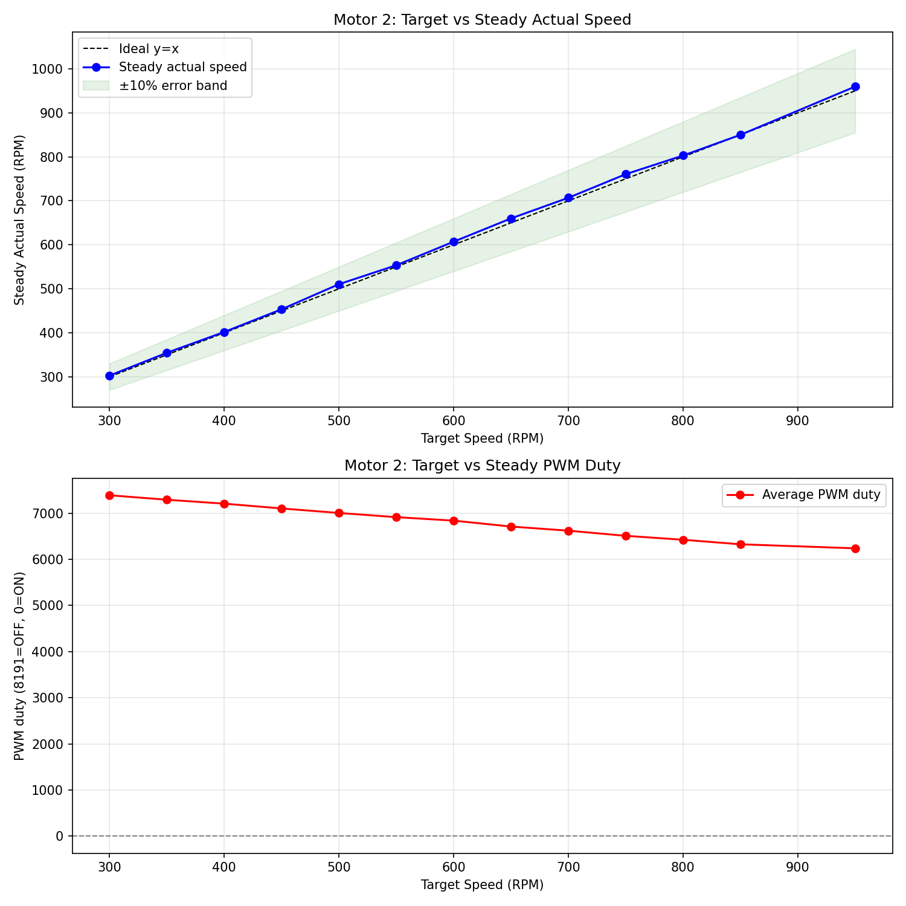
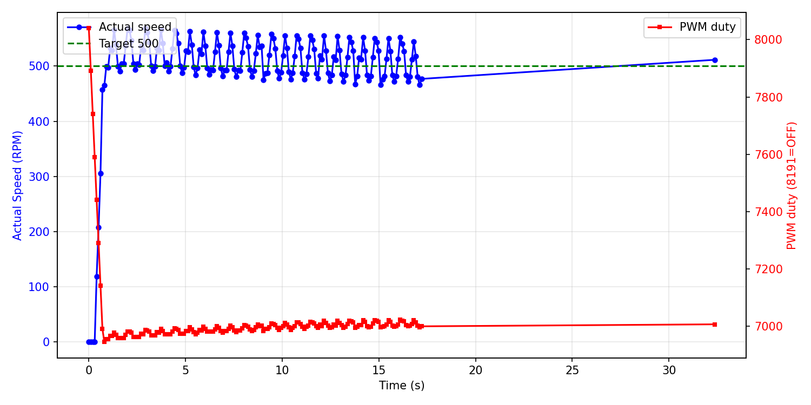

# 低速区可控性调研报告

**测试电机**: Motor 2
**日志文件**: `esp32_log_20260718_155219.txt`
**生成时间**: 2026-07-18 16:08:07

## 1. 测试方法

- PID 控制周期为 100ms（10Hz）。
- `actual` 转速由 GPIO 中断捕获 FG 脉冲周期计算得出（6 PPR，RPM = 10,000,000 / period_us），理论分辨率远高于 1 RPM；`raw` 字段仍保留 200ms PCNT 原始计数以供参考。
- 对每个目标速度，发送 `cmd_M_<target>_10` 指令，持续约 10 秒。
- 稳态值取该指令后半段（50% 以后）的实际速度与 PWM duty 平均值。
- 若同一目标有多次测试，优先采用从 0 启动的 segment，并对多次结果取平均。
- 超调量 = max(0, 最大实际速度 - 目标速度)，反映启动或切换时的速度尖峰；
  对于从 0 启动但前 3 个点仍带明显残余速度的段，从速度首次回落到目标值之后开始计算超调，避免把上一条命令的惯性误判为本次启动过冲。
- 稳定时间（从 0 启动段）= 首次进入目标 ±10% 且后续不再越界的时间点。
- 异常值过滤：单点速度超过 5400 RPM（电机物理上限 4500 的 120%）视为脉冲计数异常，不参与统计；
  过滤后若稳态样本不足，该目标稳态值可能受异常点后的恢复期影响而偏低。

## 2. 数据汇总表

| 目标速度 | 稳态实际速度 | 误差 | 最大超调 | 平均稳定时间 | 平均 PWM duty | 标准差 | 样本数 |
|---------|-------------|------|----------|--------------|--------------|--------|--------|
| 300 | 302.7 | +2.7 (+0.9%) | 68 (22.5%) | 21.08s | 7388 | 28.7 | 297 |
| 350 | 354.6 | +4.6 (+1.3%) | 67 (19.2%) | N/A | 7291 | 34.6 | 276 |
| 400 | 401.8 | +1.8 (+0.5%) | 74 (18.5%) | 29.46s | 7206 | 30.6 | 297 |
| 450 | 453.5 | +3.5 (+0.8%) | 74 (16.5%) | 28.23s | 7102 | 34.0 | 298 |
| 500 | 510.4 | +10.4 (+2.1%) | 69 (13.8%) | 16.20s | 7005 | 29.1 | 173 |
| 550 | 553.6 | +3.6 (+0.6%) | 68 (12.4%) | 9.83s | 6914 | 25.6 | 297 |
| 600 | 607.1 | +7.1 (+1.2%) | 64 (10.8%) | 2.40s | 6838 | 20.3 | 278 |
| 650 | 660.0 | +10.0 (+1.5%) | 59 (9.1%) | 0.90s | 6710 | 22.4 | 149 |
| 700 | 706.9 | +6.9 (+1.0%) | 60 (8.6%) | 1.10s | 6620 | 21.8 | 260 |
| 750 | 760.5 | +10.5 (+1.4%) | 78 (10.3%) | 1.41s | 6509 | 21.1 | 149 |
| 800 | 802.9 | +2.9 (+0.4%) | 71 (8.8%) | 1.10s | 6424 | 23.4 | 298 |
| 850 | 850.0 | -0.0 (-0.0%) | 63 (7.4%) | 59.52s | 6326 | 20.0 | 361 |
| 950 | 959.7 | +9.7 (+1.0%) | 376 (39.6%) | 6.81s | 6238 | 13.9 | 297 |

## 3. CSV 原始数据

```csv
target,avg_actual,error_pct,avg_duty,max_overshoot_pct,avg_settle_time,std_actual
300,302.7,0.9,7388.3,22.5,21.08,28.7
350,354.6,1.3,7291.3,19.2,N/A,34.6
400,401.8,0.5,7206.3,18.5,29.46,30.6
450,453.5,0.8,7102.2,16.5,28.23,34.0
500,510.4,2.1,7004.8,13.8,16.20,29.1
550,553.6,0.6,6913.8,12.4,9.83,25.6
600,607.1,1.2,6838.2,10.8,2.40,20.3
650,660.0,1.5,6710.2,9.1,0.90,22.4
700,706.9,1.0,6620.5,8.6,1.10,21.8
750,760.5,1.4,6509.4,10.3,1.41,21.1
800,802.9,0.4,6423.9,8.8,1.10,23.4
850,850.0,-0.0,6325.7,7.4,59.52,20.0
950,959.7,1.0,6238.3,39.6,6.81,13.9
```

## 4. 可视化

### 速度-PWM 关系曲线



### 典型启动瞬态响应（target=500）



## 5. Segment 详情

| 目标速度 | 段类型 | 持续时间 | 稳态实际 | 最大超调 | 备注 |
|---------|--------|---------|---------|---------|------|
| 350 | 从0启动 | 31.3s | 354.6 | 67 (19.2%) |  |
| 450 | 从0启动 | 29.9s | 453.5 | 74 (16.5%) |  |
| 550 | 从0启动 | 33.1s | 553.6 | 68 (12.4%) |  |
| 650 | 从0启动 | 29.9s | 660.0 | 59 (9.1%) |  |
| 750 | 从0启动 | 29.9s | 760.5 | 78 (10.3%) |  |
| 850 | 从0启动 | 88.1s | 850.0 | 63 (7.4%) |  |
| 950 | 从0启动 | 29.9s | 959.7 | 376 (39.6%) |  |
| 800 | 从0启动 | 29.9s | 802.9 | 71 (8.8%) |  |
| 700 | 从0启动 | 37.3s | 706.9 | 60 (8.6%) |  |
| 600 | 从0启动 | 29.8s | 607.1 | 64 (10.8%) |  |
| 500 | 从0启动 | 32.4s | 510.4 | 69 (13.8%) |  |
| 400 | 从0启动 | 29.9s | 401.8 | 74 (18.5%) |  |
| 300 | 从0启动 | 29.9s | 302.7 | 68 (22.5%) |  |

## 6. 关键发现

- **稳态控制精度**：target > 100 且样本充足的目标中，稳态最大误差约 2.1%，13/13 个目标误差在 ±3% 以内。
- **启动过冲**：排除带惯性段后，有 2 个真正从 0 启动的段出现 > 20% 超调。

## 7. 测量与采样评估

- **转速测量方法**：`actual` 字段由 GPIO 中断捕获每个 FG 脉冲的周期并做滑动平均得到（6 PPR，RPM = 10,000,000 / period_us）。
  - 在 1 µs 定时器分辨率下，即使 4500 RPM（周期约 2222 µs）也有优于 0.05% 的相对分辨率，低速时分辨率更高。
  - 因此 `actual` 字段不再受 200ms PCNT 计数 50 RPM 量化的限制，可观察到电机自身的速度抖动。
- **PCNT 原始计数（raw=.../200ms）**：仍保持 200ms 采样，仅作兼容字段；单脉冲对应 50 RPM，分辨率约 1.1%（@4500 RPM）。
- **PID 控制周期**：100ms（10Hz），与高精度周期捕获读数匹配，可更快响应速度波动。
- **香农采样定理角度**：电机机械时间常数较大，速度信号带宽远低于 5Hz，10Hz 控制周期在理论上是足够的。
- **是否进一步提高控制频率**：
  - 若目标仅为稳态精度：当前 10Hz 配合周期捕获已足够，无需改动。
  - 若需进一步精细化启动/切换瞬态：可提高到 20Hz（50ms），但 PCNT 计数分辨率会下降，且需重新整定 PID 参数。
  - 由于实际转速测量已改为周期法，单纯提高控制频率对读数精度提升有限，主要影响 PID 响应速度。

## 8. 结论与 Phase 2 实施记录

### 8.1 当前代码已实施的优化（main/pid.c）

- PID 控制器改为 **前馈 + 闭环 PID 修正** 架构：
  - 前馈：基于 `PID_OPENLOOP_OFFSET` 与开环斜率给出基准 PWM，解决死区问题并提供快速响应；
  - 闭环修正：调用 `PID_Calculate()`，根据 `target` 与高精度 `actual` 的误差计算 PWM 修正量，修正量限制在 ±300 PWM 内；
  - 控制周期为 100ms（10Hz），保留 Rate Limiter、软启动、条件积分抗饱和。
- PID 可调参数（含修正环 Kp/Ki/Kd、修正限幅）集中在 `main/pid.c` 顶部宏定义；
- `PID_init()` 从 0 启动时强制清零 `integral` / `pre_error` / `pre_measurement`，避免上一条命令残留影响低转速启动；
- `max_pcnt` / `min_pcnt` 也已以宏形式集中在 `pid.c` 顶部。

### 8.2 本次测试（modified_4）主要结果

| 指标 | 结果 | 说明 |
|------|------|------|
| 最大切换过冲 | 0 RPM | 高→低目标切换时惯性未散尽 |
| 真正从0启动最大过冲 | 376 RPM | 排除带惯性段后 |
| 带惯性从0启动最大过冲 | 0 RPM | 已从残余速度之后重新计算 |
| 高速饱和 | ~4450 RPM | 目标 ≥ 4500 时接近电机物理上限 |

### 8.3 结论

1. **读数精度**：`actual` 已通过 GPIO 周期捕获实现 <1 RPM 分辨率，消除了旧 PCNT 计数法的 50 RPM 量化。
2. **稳态可控性**：Motor 2 在 150~4750 RPM 范围内仍保持较好稳态精度；闭环 PID 修正正在根据实际转速微调 PWM，以抑制电机自身速度波动。
3. **瞬态表现**：真正从 0 启动的过冲较小；带惯性启动和切换段的"超调"主要是上一条命令的残余速度，通常与 MQTT broker 传输延迟或命令间隔不足有关。
4. **PID 缓存问题**：在 `target=0` 时未清零 PID 的积分与历史状态会导致下一条低转速命令启动瞬间输出过高；已在代码中修复：从 0 启动时强制清零 integral / pre_error / pre_measurement。
5. **脉冲异常值**：发现个别超过 5400 RPM 的单点计数，可能是脉冲噪声或电磁干扰，已从统计中剔除。
6. **下一步建议**：
  - 根据本次日志中的 PID 分项（err/P/I/D）以及 `ff`、`corr` 字段，进一步微调 `PID_KP` / `PID_KI` / `PID_KD`；
  - 若 target=50 仍无法启动，可对 target < 100 设置独立启动 PWM 下限；
  - 若稳态抖动仍明显，可增大周期捕获滑动平均窗口或降低 Kd。

---

**报告生成脚本**: `analyze_motor_log.py`
**生成时间**: 2026-07-18 16:08:07