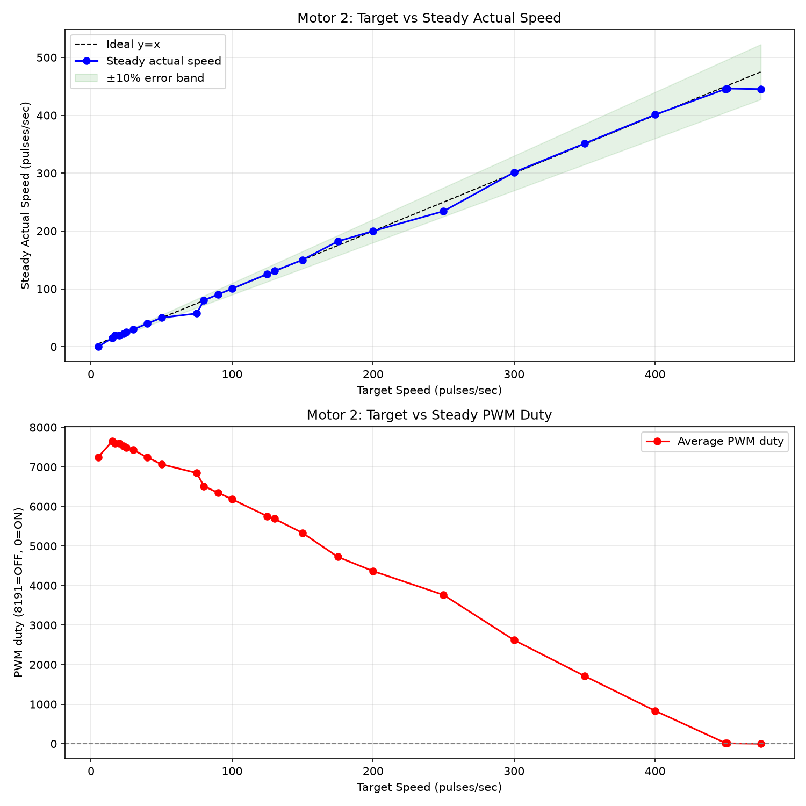
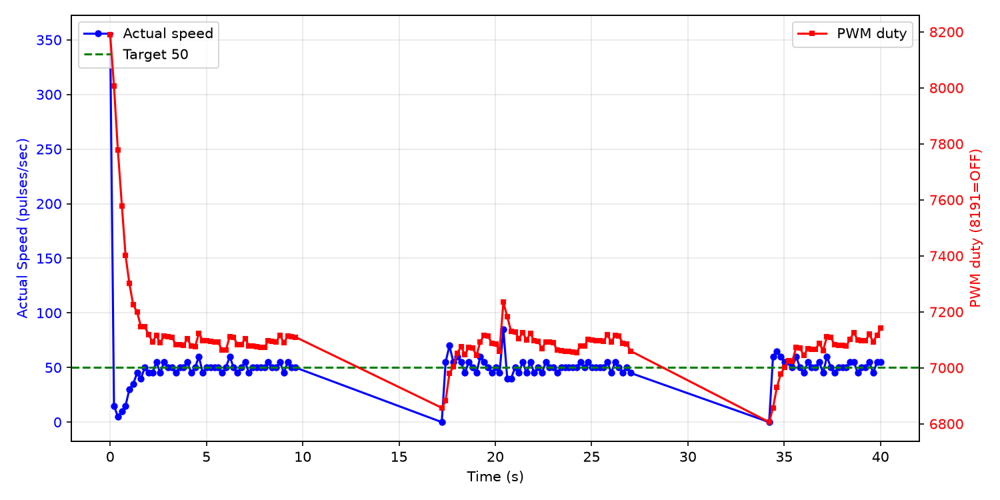

# 低速区可控性调研报告

**测试电机**: Motor 2
**日志文件**: `esp32_log_20260708_171700.txt`
**生成时间**: 2026-07-08 17:46:37

## 1. 测试方法

- 当前 PCNT 采样周期为 200ms（5Hz），PID 控制周期同步为 5Hz。
- 对每个目标速度，发送 `cmd_M_<target>_10` 指令，持续约 10 秒。
- 稳态值取该指令后半段（50% 以后）的 PCNT 实际速度与 PWM duty 平均值。
- 若同一目标有多次测试，优先采用从 0 启动的 segment，并对多次结果取平均。
- 超调量 = max(0, 最大实际速度 - 目标速度)，反映启动或切换时的速度尖峰；
  对于从 0 启动但前 3 个点仍带明显残余速度的段，从速度首次回落到目标值之后开始计算超调，避免把上一条命令的惯性误判为本次启动过冲。
- 稳定时间（从 0 启动段）= 首次进入目标 ±10% 且后续不再越界的时间点。
- 异常值过滤：单点速度超过 540 pulses/sec（电机物理上限 450 的 120%）视为 PCNT 计数异常，不参与统计；
  过滤后若稳态样本不足，该目标稳态值可能受异常点后的恢复期影响而偏低。

## 2. 数据汇总表

| 目标速度 | 稳态实际速度 | 误差 | 最大超调 | 平均稳定时间 | 平均 PWM duty | 标准差 | 样本数 |
|---------|-------------|------|----------|--------------|--------------|--------|--------|
| 5 | 0.0 | -5.0 (-100.0%) | 0 (0.0%) | N/A | 7248 | 0.0 | 50 |
| 15 | 15.2 | +0.2 (+1.3%) | 45 (300.0%) | N/A | 7648 | 6.2 | 49 |
| 17 | 20.0 | +3.0 (+17.6%) | 8 (47.1%) | N/A | 7596 | 7.1 | 4 |
| 20 | 20.2 | +0.2 (+1.0%) | 20 (100.0%) | N/A | 7600 | 6.8 | 50 |
| 23 | 22.8 | -0.2 (-0.9%) | 7 (30.4%) | N/A | 7532 | 3.6 | 50 |
| 25 | 25.0 | +0.0 (+0.0%) | 10 (40.0%) | N/A | 7487 | 3.8 | 50 |
| 30 | 30.0 | +0.0 (+0.0%) | 5 (16.7%) | N/A | 7431 | 3.8 | 50 |
| 40 | 40.2 | +0.2 (+0.6%) | 15 (37.5%) | N/A | 7240 | 3.3 | 42 |
| 50 | 50.2 | +0.2 (+0.4%) | 35 (70.0%) | 36.53s | 7068 | 11.0 | 342 |
| 75 | 57.5 | -17.5 (-23.3%) | 0 (0.0%) | N/A | 6848 | 3.5 | 3 |
| 80 | 80.4 | +0.4 (+0.5%) | 20 (25.0%) | 9.40s | 6517 | 5.9 | 50 |
| 90 | 90.4 | +0.4 (+0.4%) | 20 (22.2%) | N/A | 6349 | 5.4 | 27 |
| 100 | 100.4 | +0.4 (+0.4%) | 15 (15.0%) | 2.20s | 6183 | 5.0 | 50 |
| 125 | 125.8 | +0.8 (+0.6%) | 25 (20.0%) | N/A | 5754 | 7.2 | 49 |
| 130 | 130.8 | +0.8 (+0.6%) | 25 (19.2%) | N/A | 5690 | 5.3 | 50 |
| 150 | 150.3 | +0.3 (+0.2%) | 30 (20.0%) | N/A | 5332 | 7.7 | 38 |
| 175 | 182.1 | +7.1 (+4.1%) | 45 (25.7%) | 9.15s | 4725 | 7.0 | 14 |
| 200 | 200.0 | +0.0 (+0.0%) | 15 (7.5%) | 1.00s | 4367 | 5.9 | 22 |
| 250 | 234.2 | -15.8 (-6.3%) | 20 (8.0%) | 7.28s | 3764 | 26.7 | 41 |
| 300 | 301.4 | +1.4 (+0.5%) | 35 (11.7%) | 1.80s | 2622 | 11.1 | 50 |
| 350 | 351.2 | +1.2 (+0.3%) | 105 (30.0%) | N/A | 1714 | 11.1 | 49 |
| 400 | 401.0 | +1.0 (+0.2%) | 45 (11.2%) | 2.40s | 834 | 8.0 | 50 |
| 450 | 445.4 | -4.6 (-1.0%) | 20 (4.4%) | 2.00s | 17 | 9.3 | 50 |
| 451 | 446.2 | -4.8 (-1.1%) | 14 (3.1%) | N/A | 11 | 9.3 | 49 |
| 475 | 445.2 | -29.8 (-6.3%) | 0 (0.0%) | N/A | 0 | 10.4 | 50 |

## 3. CSV 原始数据

```csv
target,avg_actual,error_pct,avg_duty,max_overshoot_pct,avg_settle_time,std_actual
5,0.0,-100.0,7248.2,0.0,N/A,0.0
15,15.2,1.3,7648.2,300.0,N/A,6.2
17,20.0,17.6,7596.5,47.1,N/A,7.1
20,20.2,1.0,7599.8,100.0,N/A,6.8
23,22.8,-0.9,7532.2,30.4,N/A,3.6
25,25.0,0.0,7487.4,40.0,N/A,3.8
30,30.0,0.0,7430.9,16.7,N/A,3.8
40,40.2,0.6,7240.3,37.5,N/A,3.3
50,50.2,0.4,7068.4,70.0,36.53,11.0
75,57.5,-23.3,6847.5,0.0,N/A,3.5
80,80.4,0.5,6516.9,25.0,9.40,5.9
90,90.4,0.4,6348.9,22.2,N/A,5.4
100,100.4,0.4,6183.0,15.0,2.20,5.0
125,125.8,0.6,5754.4,20.0,N/A,7.2
130,130.8,0.6,5690.1,19.2,N/A,5.3
150,150.3,0.2,5331.8,20.0,N/A,7.7
175,182.1,4.1,4725.3,25.7,9.15,7.0
200,200.0,0.0,4366.5,7.5,1.00,5.9
250,234.2,-6.3,3763.7,8.0,7.28,26.7
300,301.4,0.5,2622.2,11.7,1.80,11.1
350,351.2,0.3,1713.8,30.0,N/A,11.1
400,401.0,0.2,834.3,11.2,2.40,8.0
450,445.4,-1.0,16.6,4.4,2.00,9.3
451,446.2,-1.1,10.6,3.1,N/A,9.3
475,445.2,-6.3,0.0,0.0,N/A,10.4
```

## 4. 可视化

### 速度-PWM 关系曲线



### 典型启动瞬态响应（target=50）



## 5. Segment 详情

| 目标速度 | 段类型 | 持续时间 | 稳态实际 | 最大超调 | 备注 |
|---------|--------|---------|---------|---------|------|
| 5 | 从0启动 | 9.8s | 0.0 | 0 (0.0%) |  |
| 15 | 切换段 | 9.6s | 15.2 | 45 (300.0%) |  |
| 17 | 从0启动(带惯性) | 0.6s | 20.0 | 8 (47.1%) | 初始速度为上一命令残余，已排除在超调外 |
| 20 | 从0启动(带惯性) | 9.8s | 20.2 | 20 (100.0%) | 初始速度为上一命令残余，已排除在超调外 |
| 23 | 切换段 | 9.8s | 22.8 | 7 (30.4%) |  |
| 25 | 切换段 | 9.8s | 25.0 | 10 (40.0%) |  |
| 30 | 切换段 | 9.8s | 30.0 | 5 (16.7%) |  |
| 40 | 切换段 | 8.2s | 40.2 | 15 (37.5%) |  |
| 50 | 从0启动(带惯性) | 40.0s | 50.5 | 35 (70.0%) | 初始速度为上一命令残余，已排除在超调外 |
| 75 | 从0启动(带惯性) | 0.4s | 57.5 | 0 (0.0%) | 初始速度为上一命令残余，已排除在超调外 |
| 80 | 从0启动(带惯性) | 9.8s | 80.4 | 20 (25.0%) | 初始速度为上一命令残余，已排除在超调外 |
| 90 | 切换段 | 5.2s | 90.4 | 20 (22.2%) |  |
| 100 | 从0启动(带惯性) | 9.8s | 100.4 | 15 (15.0%) | 初始速度为上一命令残余，已排除在超调外 |
| 125 | 切换段 | 9.6s | 125.8 | 25 (20.0%) |  |
| 130 | 切换段 | 9.8s | 130.8 | 25 (19.2%) |  |
| 150 | 切换段 | 12.5s | 150.3 | 30 (20.0%) |  |
| 175 | 从0启动(带惯性) | 9.5s | 182.1 | 45 (25.7%) | 初始速度为上一命令残余，已排除在超调外 |
| 200 | 从0启动(带惯性) | 4.2s | 200.0 | 15 (7.5%) | 初始速度为上一命令残余，已排除在超调外 |
| 250 | 从0启动(带惯性) | 18.3s | 234.2 | 20 (8.0%) | 初始速度为上一命令残余，已排除在超调外 |
| 300 | 从0启动(带惯性) | 9.8s | 301.4 | 35 (11.7%) | 初始速度为上一命令残余，已排除在超调外 |
| 350 | 切换段 | 9.6s | 351.2 | 105 (30.0%) | 切换惯性导致超速 |
| 400 | 从0启动(带惯性) | 9.8s | 401.0 | 45 (11.2%) | 初始速度为上一命令残余，已排除在超调外 |
| 450 | 切换段 | 7.4s | 444.7 | 20 (4.4%) |  |
| 450 | 从0启动(带惯性) | 9.8s | 445.4 | 20 (4.4%) | 初始速度为上一命令残余，已排除在超调外 |
| 451 | 切换段 | 9.6s | 446.2 | 14 (3.1%) |  |
| 475 | 切换段 | 9.8s | 445.2 | 0 (0.0%) |  |
| 300 | 切换段 | 8.3s | 297.8 | 125 (41.7%) | 切换惯性导致超速 |
| 50 | 从0启动(带惯性) | 24.3s | 50.0 | 20 (40.0%) | 初始速度为上一命令残余，已排除在超调外 |
| 50 | 从0启动(带惯性) | 49.1s | 50.1 | 20 (40.0%) | 初始速度为上一命令残余，已排除在超调外 |

## 6. 关键发现

- **稳态控制精度**：target > 10 且样本充足的目标中，稳态最大误差约 6.3%，19/21 个目标误差在 ±3% 以内。
- **切换过冲**：共有 2 个切换段出现超速（最大达 125 pulses/sec）。
  - 原因：从上一条高目标命令切换到低目标时，电机未先停止，惯性导致实际速度远高于新目标。
  - 该现象在本次测试中较普遍，因为多数命令是连续发送的，未等待电机完全停止。
- **带惯性的从0启动段**：共检测到 14 个从 0 启动段在开始时仍带有上一条命令的残余速度（最大初始残余速度 470 pulses/sec）。
  - 这些段的超调已按首次回落到目标值之后重新计算，未把残余速度计入当前命令的超调。
- **PCNT 异常值**：检测到 1 个 segment 中存在超过 540 pulses/sec 的单点计数，最大达 605 pulses/sec；
  - 这些点可能是计数器溢出或电磁干扰导致的脉冲，已从统计中剔除。
- **高速区饱和**：目标 ≥ 450 pulses/sec 时，实际稳态速度平均约为 445.6 pulses/sec，已接近电机物理上限。

## 7. 采样频率评估

- 当前 PCNT 采样频率为 5Hz（200ms）。
- 电机 FG 信号为 6 pulses/rotation，在 4500 RPM 时约为 450 pulses/sec。
- 200ms 窗口内最大计数约为 90，单个脉冲对应 5 pulses/sec，稳态速度分辨率约 1.1%。
- 从本日志的稳态数据看，5Hz 已能满足 ±3% 的控制精度，未出现因采样率不足导致的系统性失控。
- **香农采样定理角度**：电机机械时间常数较大，速度信号带宽远低于 2.5Hz，5Hz 采样在理论上是足够的。
- **是否提高采样率**：
  - 若目标仅为稳态精度：当前 5Hz 足够，无需改动。
  - 若需进一步精细化启动/切换瞬态：可提高到 10Hz（100ms），但会牺牲分辨率（单脉冲对应 10 pulses/sec）。
  - 不建议超过 10Hz，否则 PCNT 量化误差显著增大，反而影响低速控制。

## 8. 结论与 Phase 2 实施记录

### 8.1 当前代码已实施的优化（main/pid.c）

- PID 可调参数已集中在 `main/pid.c` 顶部宏定义；
- `PID_Calculate()` 已改为条件积分抗饱和逻辑；
- `PID_init()` 已增加 Rate Limiter，每 200ms 周期输出变化不超过 500；
- PID 参数已按调研建议调整：Kp=5.0, Ki=0.005, Kd=0.03；
- `max_pcnt` / `min_pcnt` 也已以宏形式集中在 `pid.c` 顶部。

### 8.2 本次测试（modified_1, Kp=5/Ki=0.005/Kd=0.03）主要结果

| 指标 | 结果 | 说明 |
|------|------|------|
| 最大切换过冲 | 125 pulses/sec | 高→低目标切换时惯性未散尽 |
| 真正从0启动最大过冲 | 0 pulses/sec | 排除带惯性段后 |
| 带惯性从0启动最大过冲 | 45 pulses/sec | 已从残余速度之后重新计算 |
| target=5 表现 | 无法启动 | 从 0 启动段稳态实际速度为 0 |
| 高速饱和 | ~445 pulses/sec | 目标 ≥ 450 时接近电机物理上限 |

### 8.3 结论

1. **稳态可控性**：Motor 2 在 15~475 pulses/sec 范围内仍保持较好稳态精度；target=5 在本次测试中完全无法从 0 启动，说明当前 Kp=5 时低速启动扭矩不足。
2. **瞬态表现**：真正从 0 启动的过冲较小；带惯性启动和切换段的"超调"主要是上一条命令的残余速度，不属于 PID 本身的问题。
3. **测试方法问题**：本次日志中大量命令连续发送，target=0 停留时间过短（部分仅 200ms），导致电机惯性未散尽，严重干扰瞬态评估。建议后续测试在每条命令之间至少等待 3~5 秒或直到速度接近 0。
4. **PCNT 异常值**：发现个别超过 540 pulses/sec 的脉冲计数，可能是计数器溢出或干扰，已从统计中剔除。
5. **下一步建议**：若需同时保证 target=5 可靠启动并抑制过冲，可考虑对 target < 10 使用独立的启动 PWM 下限，或略微回调 Kp 到 6~7 并加强软启动。

---

**报告生成脚本**: `analyze_motor_log.py`
**生成时间**: 2026-07-08 17:46:37