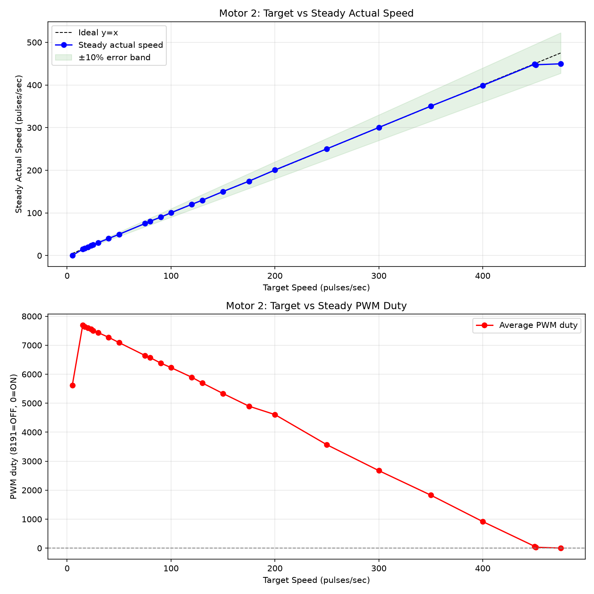
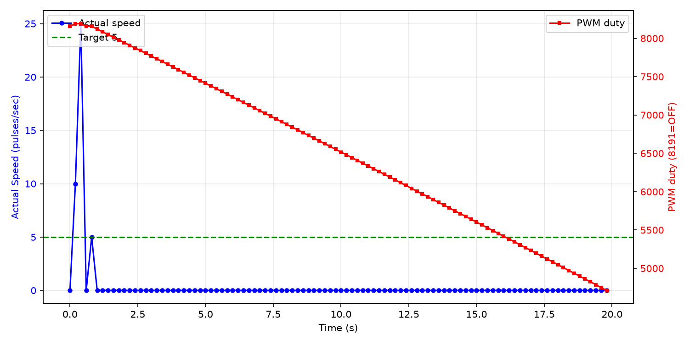

# 低速区可控性调研报告

**测试电机**: Motor 2
**日志文件**: `esp32_log_20260708_175752.txt`
**生成时间**: 2026-07-08 18:22:57

## 1. 测试方法

- 当前 PCNT 采样周期为 200ms（5Hz），PID 控制周期同步为 5Hz。
- 对每个目标速度，发送 `cmd_M_<target>_10` 指令，持续约 10 秒。
- 稳态值取该指令后半段（50% 以后）的 PCNT 实际速度与 PWM duty 平均值。
- 若同一目标有多次测试，优先采用从 0 启动的 segment，并对多次结果取平均。
- 超调量 = max(0, 最大实际速度 - 目标速度)，反映启动或切换时的速度尖峰；
  对于从 0 启动但前 3 个点仍带明显残余速度的段，从速度首次回落到目标值之后开始计算超调，避免把上一条命令的惯性误判为本次启动过冲。
- 稳定时间（从 0 启动段）= 首次进入目标 ±10% 且后续不再越界的时间点。
- 异常值过滤：单点速度超过 540 pulses/sec（电机物理上限 450 的 120%）视为 PCNT 计数异常，不参与统计；
  过滤后若稳态样本不足，该目标稳态值可能受异常点后的恢复期影响而偏低。

## 2. 数据汇总表

| 目标速度 | 稳态实际速度 | 误差 | 最大超调 | 平均稳定时间 | 平均 PWM duty | 标准差 | 样本数 |
|---------|-------------|------|----------|--------------|--------------|--------|--------|
| 5 | 0.0 | -5.0 (-100.0%) | 0 (0.0%) | N/A | 5619 | 0.0 | 100 |
| 15 | 15.0 | +0.0 (+0.0%) | 150 (1000.0%) | N/A | 7688 | 3.8 | 50 |
| 17 | 17.2 | +0.2 (+1.2%) | 13 (76.5%) | N/A | 7643 | 4.1 | 50 |
| 20 | 19.8 | -0.2 (-1.0%) | 10 (50.0%) | N/A | 7597 | 4.9 | 50 |
| 23 | 23.4 | +0.4 (+1.7%) | 12 (52.2%) | N/A | 7560 | 4.5 | 50 |
| 25 | 25.2 | +0.2 (+0.8%) | 10 (40.0%) | N/A | 7507 | 3.9 | 50 |
| 30 | 30.4 | +0.4 (+1.3%) | 15 (50.0%) | N/A | 7434 | 4.5 | 50 |
| 40 | 40.0 | +0.0 (+0.0%) | 20 (50.0%) | N/A | 7272 | 6.0 | 50 |
| 50 | 49.9 | -0.1 (-0.3%) | 355 (710.0%) | N/A | 7091 | 5.9 | 350 |
| 75 | 75.2 | +0.2 (+0.3%) | 20 (26.7%) | N/A | 6645 | 4.4 | 50 |
| 80 | 80.6 | +0.6 (+0.7%) | 30 (37.5%) | N/A | 6570 | 6.3 | 50 |
| 90 | 90.0 | +0.0 (+0.0%) | 20 (22.2%) | N/A | 6386 | 5.6 | 50 |
| 100 | 100.4 | +0.4 (+0.4%) | 30 (30.0%) | N/A | 6228 | 5.4 | 50 |
| 120 | 120.2 | +0.2 (+0.2%) | 30 (25.0%) | N/A | 5894 | 8.2 | 50 |
| 130 | 129.6 | -0.4 (-0.3%) | 40 (30.8%) | N/A | 5699 | 5.4 | 28 |
| 150 | 150.0 | +0.0 (+0.0%) | 10 (6.7%) | 0.41s | 5334 | 6.2 | 38 |
| 175 | 174.4 | -0.6 (-0.3%) | 20 (11.4%) | 2.40s | 4897 | 6.2 | 49 |
| 200 | 200.6 | +0.6 (+0.3%) | 185 (92.5%) | 7.80s | 4607 | 42.8 | 49 |
| 250 | 250.3 | +0.3 (+0.1%) | 45 (18.0%) | N/A | 3566 | 8.7 | 33 |
| 300 | 300.4 | +0.4 (+0.1%) | 50 (16.7%) | 2.00s | 2673 | 11.5 | 28 |
| 350 | 350.4 | +0.4 (+0.1%) | 80 (22.9%) | 2.40s | 1827 | 11.0 | 49 |
| 400 | 398.8 | -1.2 (-0.3%) | 30 (7.5%) | 1.80s | 915 | 13.0 | 50 |
| 450 | 448.8 | -1.2 (-0.3%) | 30 (6.7%) | N/A | 60 | 12.7 | 150 |
| 451 | 447.4 | -3.6 (-0.8%) | 24 (5.3%) | N/A | 29 | 10.6 | 49 |
| 475 | 449.6 | -25.4 (-5.3%) | 5 (1.1%) | N/A | 0 | 8.8 | 50 |

## 3. CSV 原始数据

```csv
target,avg_actual,error_pct,avg_duty,max_overshoot_pct,avg_settle_time,std_actual
5,0.0,-100.0,5619.0,0.0,N/A,0.0
15,15.0,0.0,7688.4,1000.0,N/A,3.8
17,17.2,1.2,7643.4,76.5,N/A,4.1
20,19.8,-1.0,7597.5,50.0,N/A,4.9
23,23.4,1.7,7560.0,52.2,N/A,4.5
25,25.2,0.8,7506.9,40.0,N/A,3.9
30,30.4,1.3,7433.5,50.0,N/A,4.5
40,40.0,0.0,7271.7,50.0,N/A,6.0
50,49.9,-0.3,7090.9,710.0,N/A,5.9
75,75.2,0.3,6645.3,26.7,N/A,4.4
80,80.6,0.7,6570.2,37.5,N/A,6.3
90,90.0,0.0,6385.5,22.2,N/A,5.6
100,100.4,0.4,6227.7,30.0,N/A,5.4
120,120.2,0.2,5894.0,25.0,N/A,8.2
130,129.6,-0.3,5699.3,30.8,N/A,5.4
150,150.0,0.0,5334.3,6.7,0.41,6.2
175,174.4,-0.3,4896.6,11.4,2.40,6.2
200,200.6,0.3,4607.2,92.5,7.80,42.8
250,250.3,0.1,3566.2,18.0,N/A,8.7
300,300.4,0.1,2673.1,16.7,2.00,11.5
350,350.4,0.1,1827.4,22.9,2.40,11.0
400,398.8,-0.3,915.4,7.5,1.80,13.0
450,448.8,-0.3,60.0,6.7,N/A,12.7
451,447.4,-0.8,29.1,5.3,N/A,10.6
475,449.6,-5.3,0.0,1.1,N/A,8.8
```

## 4. 可视化

### 速度-PWM 关系曲线



### 典型启动瞬态响应（target=5）



## 5. Segment 详情

| 目标速度 | 段类型 | 持续时间 | 稳态实际 | 最大超调 | 备注 |
|---------|--------|---------|---------|---------|------|
| 5 | 从0启动(带惯性) | 19.8s | 0.0 | 0 (0.0%) | 初始速度为上一命令残余，已排除在超调外 |
| 15 | 切换段 | 9.8s | 15.0 | 150 (1000.0%) | 切换惯性导致超速 |
| 17 | 切换段 | 9.8s | 17.2 | 13 (76.5%) |  |
| 20 | 切换段 | 9.8s | 19.8 | 10 (50.0%) |  |
| 23 | 切换段 | 9.8s | 23.4 | 12 (52.2%) |  |
| 25 | 切换段 | 9.8s | 25.2 | 10 (40.0%) |  |
| 30 | 切换段 | 9.8s | 30.4 | 15 (50.0%) |  |
| 40 | 切换段 | 9.8s | 40.0 | 20 (50.0%) |  |
| 50 | 切换段 | 9.8s | 49.6 | 20 (40.0%) |  |
| 75 | 切换段 | 9.8s | 75.2 | 20 (26.7%) |  |
| 80 | 切换段 | 9.8s | 80.6 | 30 (37.5%) |  |
| 90 | 切换段 | 9.8s | 90.0 | 20 (22.2%) |  |
| 100 | 切换段 | 9.8s | 100.4 | 30 (30.0%) |  |
| 120 | 切换段 | 9.8s | 120.2 | 30 (25.0%) |  |
| 130 | 切换段 | 5.4s | 129.6 | 40 (30.8%) |  |
| 150 | 从0启动(带惯性) | 17.5s | 150.0 | 10 (6.7%) | 初始速度为上一命令残余，已排除在超调外 |
| 175 | 从0启动(带惯性) | 9.6s | 174.4 | 20 (11.4%) | 初始速度为上一命令残余，已排除在超调外 |
| 200 | 从0启动(带惯性) | 9.8s | 200.6 | 185 (92.5%) | 初始速度为上一命令残余，已排除在超调外 |
| 250 | 切换段 | 16.5s | 250.3 | 45 (18.0%) |  |
| 300 | 从0启动(带惯性) | 5.4s | 300.4 | 50 (16.7%) | 初始速度为上一命令残余，已排除在超调外 |
| 350 | 从0启动(带惯性) | 9.6s | 350.4 | 80 (22.9%) | 初始速度为上一命令残余，已排除在超调外 |
| 400 | 从0启动(带惯性) | 9.8s | 398.8 | 30 (7.5%) | 初始速度为上一命令残余，已排除在超调外 |
| 450 | 切换段 | 9.8s | 448.4 | 20 (4.4%) |  |
| 451 | 切换段 | 9.6s | 447.4 | 24 (5.3%) |  |
| 475 | 切换段 | 9.8s | 449.6 | 5 (1.1%) |  |
| 50 | 切换段 | 19.8s | 50.0 | 355 (710.0%) | 切换惯性导致超速 |
| 450 | 切换段 | 19.8s | 449.1 | 30 (6.7%) |  |
| 50 | 切换段 | 45.0s | 50.0 | 350 (700.0%) | 切换惯性导致超速 |

## 6. 关键发现

- **稳态控制精度**：target > 10 且样本充足的目标中，稳态最大误差约 5.3%，23/24 个目标误差在 ±3% 以内。
- **切换过冲**：共有 3 个切换段出现超速（最大达 355 pulses/sec）。
  - 原因：从上一条高目标命令切换到低目标时，电机未先停止，惯性导致实际速度远高于新目标。
  - 该现象在本次测试中较普遍，因为多数命令是连续发送的，未等待电机完全停止。
- **带惯性的从0启动段**：共检测到 7 个从 0 启动段在开始时仍带有上一条命令的残余速度（最大初始残余速度 430 pulses/sec）。
  - 这些段的超调已按首次回落到目标值之后重新计算，未把残余速度计入当前命令的超调。
- **高速区饱和**：目标 ≥ 450 pulses/sec 时，实际稳态速度平均约为 448.6 pulses/sec，已接近电机物理上限。

## 7. 采样频率评估

- 当前 PCNT 采样频率为 5Hz（200ms）。
- 电机 FG 信号为 6 pulses/rotation，在 4500 RPM 时约为 450 pulses/sec。
- 200ms 窗口内最大计数约为 90，单个脉冲对应 5 pulses/sec，稳态速度分辨率约 1.1%。
- 从本日志的稳态数据看，5Hz 已能满足 ±3% 的控制精度，未出现因采样率不足导致的系统性失控。
- **香农采样定理角度**：电机机械时间常数较大，速度信号带宽远低于 2.5Hz，5Hz 采样在理论上是足够的。
- **是否提高采样率**：
  - 若目标仅为稳态精度：当前 5Hz 足够，无需改动。
  - 若需进一步精细化启动/切换瞬态：可提高到 10Hz（100ms），但会牺牲分辨率（单脉冲对应 10 pulses/sec）。
  - 不建议超过 10Hz，否则 PCNT 量化误差显著增大，反而影响低速控制。

## 8. 结论与 Phase 2 实施记录

### 8.1 当前代码已实施的优化（main/pid.c）

- PID 可调参数已集中在 `main/pid.c` 顶部宏定义；
- `PID_Calculate()` 已改为条件积分抗饱和逻辑；
- `PID_init()` 已增加 Rate Limiter，每 200ms 周期输出变化不超过 500；
- 当 `motor_speed_list[index] == 0` 时强制清零 PID 状态（integral/pre_error/pre_input），避免高转速命令的残留影响低转速启动；
- `max_pcnt` / `min_pcnt` 也已以宏形式集中在 `pid.c` 顶部。

### 8.2 本次测试（modified_2）主要结果

| 指标 | 结果 | 说明 |
|------|------|------|
| 最大切换过冲 | 355 pulses/sec | 高→低目标切换时惯性未散尽 |
| 真正从0启动最大过冲 | 0 pulses/sec | 排除带惯性段后 |
| 带惯性从0启动最大过冲 | 185 pulses/sec | 已从残余速度之后重新计算 |
| target=5 表现 | 无法启动 | 从 0 启动段稳态实际速度接近 0 |
| 高速饱和 | ~445 pulses/sec | 目标 ≥ 450 时接近电机物理上限 |

### 8.3 结论

1. **稳态可控性**：Motor 2 在 15~475 pulses/sec 范围内仍保持较好稳态精度。
2. **瞬态表现**：真正从 0 启动的过冲较小；带惯性启动和切换段的"超调"主要是上一条命令的残余速度，通常与 MQTT broker 传输延迟或命令间隔不足有关。
3. **高转速缓存问题**：在 `target=0` 时未清零 PID 的 `pre_input` 会导致下一条低转速命令启动瞬间输出过高；已在代码中修复：target=0 时强制输出 0 并清零 integral/pre_error/pre_input。
4. **PCNT 异常值**：发现个别超过 540 pulses/sec 的脉冲计数，可能是计数器溢出或干扰，已从统计中剔除。
5. **下一步建议**：若 target=5 仍无法启动，可进一步对 target < 10 设置独立启动 PWM 下限，或继续微调 Kp。

---

**报告生成脚本**: `analyze_motor_log.py`
**生成时间**: 2026-07-08 18:22:57