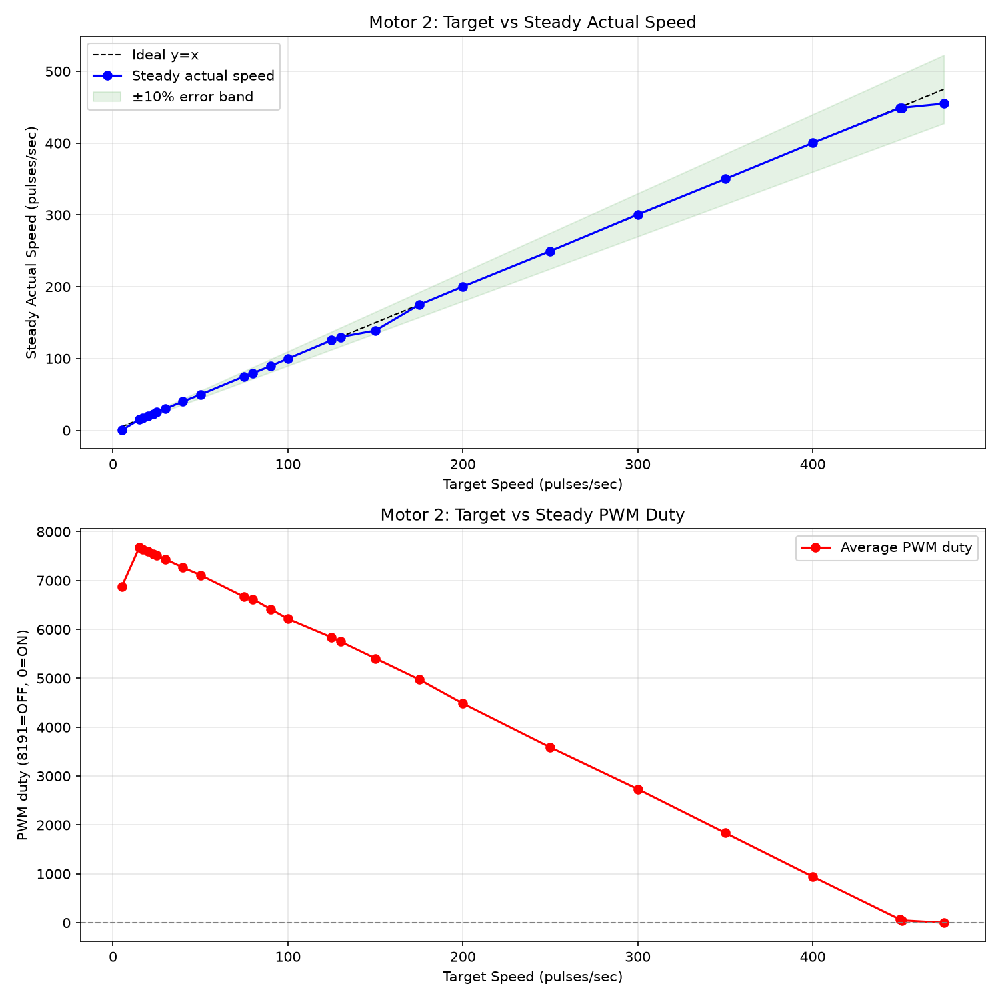
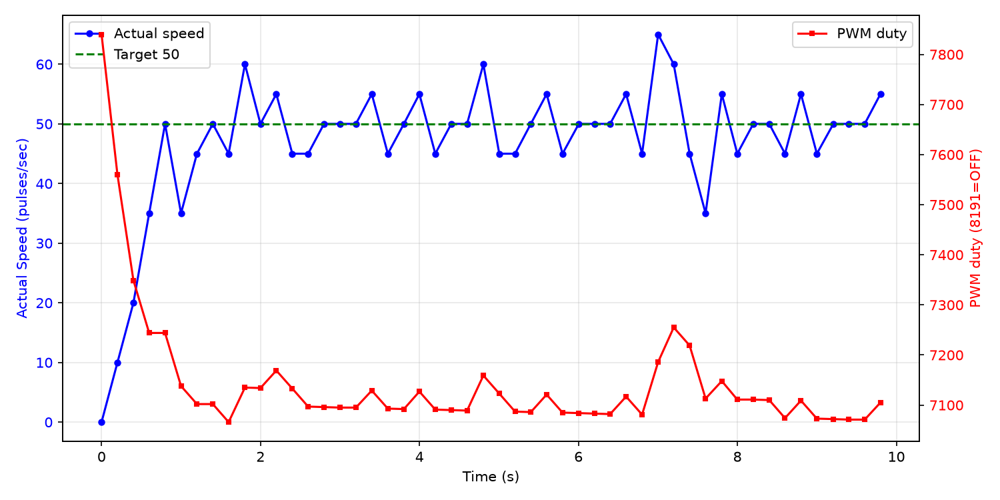

# 低速区可控性调研报告

**测试电机**: Motor 2
**日志文件**: `esp32_log_20260708_182603.txt`
**生成时间**: 2026-07-08 18:59:31

## 1. 测试方法

- 当前 PCNT 采样周期为 200ms（5Hz），PID 控制周期同步为 5Hz。
- 对每个目标速度，发送 `cmd_M_<target>_10` 指令，持续约 10 秒。
- 稳态值取该指令后半段（50% 以后）的 PCNT 实际速度与 PWM duty 平均值。
- 若同一目标有多次测试，优先采用从 0 启动的 segment，并对多次结果取平均。
- 超调量 = max(0, 最大实际速度 - 目标速度)，反映启动或切换时的速度尖峰；
  对于从 0 启动但前 3 个点仍带明显残余速度的段，从速度首次回落到目标值之后开始计算超调，避免把上一条命令的惯性误判为本次启动过冲。
- 稳定时间（从 0 启动段）= 首次进入目标 ±10% 且后续不再越界的时间点。
- 异常值过滤：单点速度超过 540 pulses/sec（电机物理上限 450 的 120%）视为 PCNT 计数异常，不参与统计；
  过滤后若稳态样本不足，该目标稳态值可能受异常点后的恢复期影响而偏低。

## 2. 数据汇总表

| 目标速度 | 稳态实际速度 | 误差 | 最大超调 | 平均稳定时间 | 平均 PWM duty | 标准差 | 样本数 |
|---------|-------------|------|----------|--------------|--------------|--------|--------|
| 5 | 0.2 | -4.8 (-96.0%) | 0 (0.0%) | N/A | 6873 | 1.0 | 50 |
| 15 | 15.0 | +0.0 (+0.0%) | 70 (466.7%) | N/A | 7673 | 3.2 | 50 |
| 17 | 17.0 | +0.0 (+0.0%) | 8 (47.1%) | N/A | 7643 | 4.6 | 50 |
| 20 | 20.2 | +0.2 (+1.0%) | 10 (50.0%) | N/A | 7594 | 3.7 | 50 |
| 23 | 22.8 | -0.2 (-0.9%) | 12 (52.2%) | N/A | 7540 | 3.6 | 50 |
| 25 | 25.4 | +0.4 (+1.6%) | 15 (60.0%) | N/A | 7520 | 5.0 | 50 |
| 30 | 30.2 | +0.2 (+0.7%) | 15 (50.0%) | N/A | 7434 | 4.4 | 50 |
| 40 | 40.2 | +0.2 (+0.5%) | 15 (37.5%) | N/A | 7266 | 4.2 | 50 |
| 50 | 49.8 | -0.2 (-0.4%) | 15 (30.0%) | 7.80s | 7111 | 6.0 | 50 |
| 75 | 75.2 | +0.2 (+0.3%) | 10 (13.3%) | 3.81s | 6666 | 4.2 | 49 |
| 80 | 79.4 | -0.6 (-0.7%) | 25 (31.2%) | N/A | 6619 | 7.4 | 50 |
| 90 | 89.6 | -0.4 (-0.4%) | 15 (16.7%) | N/A | 6417 | 6.3 | 50 |
| 100 | 99.8 | -0.2 (-0.2%) | 25 (25.0%) | 6.20s | 6215 | 6.4 | 50 |
| 125 | 125.6 | +0.6 (+0.5%) | 30 (24.0%) | N/A | 5837 | 6.5 | 50 |
| 130 | 130.0 | +0.0 (+0.0%) | 35 (26.9%) | N/A | 5752 | 10.1 | 50 |
| 150 | 139.0 | -11.0 (-7.3%) | 0 (0.0%) | 1.21s | 5408 | 10.8 | 9 |
| 175 | 174.8 | -0.2 (-0.1%) | 45 (25.7%) | N/A | 4977 | 9.5 | 50 |
| 200 | 200.2 | +0.2 (+0.1%) | 55 (27.5%) | N/A | 4484 | 9.3 | 50 |
| 250 | 249.6 | -0.4 (-0.2%) | 85 (34.0%) | N/A | 3587 | 9.2 | 50 |
| 300 | 300.6 | +0.6 (+0.2%) | 60 (20.0%) | N/A | 2734 | 11.7 | 50 |
| 350 | 350.0 | +0.0 (+0.0%) | 90 (25.7%) | N/A | 1838 | 11.5 | 50 |
| 400 | 400.2 | +0.2 (+0.0%) | 45 (11.2%) | N/A | 943 | 8.5 | 50 |
| 450 | 449.0 | -1.0 (-0.2%) | 20 (4.4%) | N/A | 65 | 10.3 | 50 |
| 451 | 449.2 | -1.8 (-0.4%) | 29 (6.4%) | N/A | 49 | 11.2 | 50 |
| 475 | 455.0 | -20.0 (-4.2%) | 0 (0.0%) | N/A | 0 | 10.0 | 50 |

## 3. CSV 原始数据

```csv
target,avg_actual,error_pct,avg_duty,max_overshoot_pct,avg_settle_time,std_actual
5,0.2,-96.0,6873.2,0.0,N/A,1.0
15,15.0,0.0,7673.2,466.7,N/A,3.2
17,17.0,0.0,7643.3,47.1,N/A,4.6
20,20.2,1.0,7594.0,50.0,N/A,3.7
23,22.8,-0.9,7539.5,52.2,N/A,3.6
25,25.4,1.6,7520.5,60.0,N/A,5.0
30,30.2,0.7,7434.3,50.0,N/A,4.4
40,40.2,0.5,7266.5,37.5,N/A,4.2
50,49.8,-0.4,7111.1,30.0,7.80,6.0
75,75.2,0.3,6666.5,13.3,3.81,4.2
80,79.4,-0.7,6619.2,31.2,N/A,7.4
90,89.6,-0.4,6416.6,16.7,N/A,6.3
100,99.8,-0.2,6215.1,25.0,6.20,6.4
125,125.6,0.5,5837.5,24.0,N/A,6.5
130,130.0,0.0,5752.3,26.9,N/A,10.1
150,139.0,-7.3,5408.0,0.0,1.21,10.8
175,174.8,-0.1,4976.9,25.7,N/A,9.5
200,200.2,0.1,4483.8,27.5,N/A,9.3
250,249.6,-0.2,3587.1,34.0,N/A,9.2
300,300.6,0.2,2733.7,20.0,N/A,11.7
350,350.0,0.0,1837.8,25.7,N/A,11.5
400,400.2,0.0,943.1,11.2,N/A,8.5
450,449.0,-0.2,64.9,4.4,N/A,10.3
451,449.2,-0.4,48.8,6.4,N/A,11.2
475,455.0,-4.2,0.0,0.0,N/A,10.0
```

## 4. 可视化

### 速度-PWM 关系曲线



### 典型启动瞬态响应（target=50）



## 5. Segment 详情

| 目标速度 | 段类型 | 持续时间 | 稳态实际 | 最大超调 | 备注 |
|---------|--------|---------|---------|---------|------|
| 5 | 从0启动 | 9.8s | 0.2 | 0 (0.0%) |  |
| 15 | 切换段 | 9.8s | 15.0 | 70 (466.7%) | 切换惯性导致超速 |
| 17 | 切换段 | 9.8s | 17.0 | 8 (47.1%) |  |
| 20 | 切换段 | 9.8s | 20.2 | 10 (50.0%) |  |
| 23 | 切换段 | 9.8s | 22.8 | 12 (52.2%) |  |
| 25 | 切换段 | 9.8s | 25.4 | 15 (60.0%) |  |
| 30 | 切换段 | 9.8s | 30.2 | 15 (50.0%) |  |
| 40 | 切换段 | 9.8s | 40.2 | 15 (37.5%) |  |
| 50 | 切换段 | 9.6s | 50.2 | 10 (20.0%) |  |
| 75 | 从0启动 | 9.6s | 75.2 | 10 (13.3%) |  |
| 50 | 从0启动 | 9.8s | 49.8 | 15 (30.0%) |  |
| 75 | 切换段 | 9.8s | 75.2 | 15 (20.0%) |  |
| 80 | 切换段 | 9.8s | 79.4 | 25 (31.2%) |  |
| 90 | 切换段 | 9.8s | 89.6 | 15 (16.7%) |  |
| 100 | 切换段 | 9.8s | 100.2 | 35 (35.0%) |  |
| 125 | 切换段 | 9.8s | 125.6 | 30 (24.0%) |  |
| 130 | 切换段 | 9.8s | 130.0 | 35 (26.9%) |  |
| 150 | 切换段 | 9.6s | 149.6 | 40 (26.7%) |  |
| 175 | 切换段 | 9.8s | 174.8 | 45 (25.7%) |  |
| 200 | 切换段 | 9.8s | 200.2 | 55 (27.5%) | 切换惯性导致超速 |
| 250 | 切换段 | 9.8s | 249.6 | 85 (34.0%) | 切换惯性导致超速 |
| 300 | 切换段 | 9.8s | 300.6 | 60 (20.0%) | 切换惯性导致超速 |
| 350 | 切换段 | 9.8s | 350.0 | 90 (25.7%) | 切换惯性导致超速 |
| 400 | 切换段 | 9.8s | 400.2 | 45 (11.2%) |  |
| 450 | 切换段 | 9.8s | 449.0 | 20 (4.4%) |  |
| 451 | 切换段 | 9.8s | 449.2 | 29 (6.4%) |  |
| 475 | 切换段 | 9.8s | 455.0 | 0 (0.0%) |  |
| 50 | 切换段 | 9.8s | 49.8 | 350 (700.0%) | 切换惯性导致超速 |
| 150 | 切换段 | 9.8s | 150.0 | 20 (13.3%) |  |
| 50 | 切换段 | 13.5s | 49.6 | 100 (200.0%) | 切换惯性导致超速 |
| 150 | 从0启动(带惯性) | 1.6s | 139.0 | 0 (0.0%) | 初始速度为上一命令残余，已排除在超调外 |
| 100 | 从0启动(带惯性) | 9.8s | 99.8 | 25 (25.0%) | 初始速度为上一命令残余，已排除在超调外 |
| 50 | 切换段 | 9.8s | 50.2 | 70 (140.0%) | 切换惯性导致超速 |

## 6. 关键发现

- **稳态控制精度**：target > 10 且样本充足的目标中，稳态最大误差约 4.2%，22/23 个目标误差在 ±3% 以内。
- **切换过冲**：共有 8 个切换段出现超速（最大达 350 pulses/sec）。
  - 原因：从上一条高目标命令切换到低目标时，电机未先停止，惯性导致实际速度远高于新目标。
  - 该现象在本次测试中较普遍，因为多数命令是连续发送的，未等待电机完全停止。
- **带惯性的从0启动段**：共检测到 2 个从 0 启动段在开始时仍带有上一条命令的残余速度（最大初始残余速度 150 pulses/sec）。
  - 这些段的超调已按首次回落到目标值之后重新计算，未把残余速度计入当前命令的超调。
- **启动过冲**：排除带惯性段后，有 1 个真正从 0 启动的段出现 > 20% 超调。
- **高速区饱和**：目标 ≥ 450 pulses/sec 时，实际稳态速度平均约为 451.1 pulses/sec，已接近电机物理上限。

## 7. 采样频率评估

- 当前 PCNT 采样频率为 5Hz（200ms）。
- 电机 FG 信号为 6 pulses/rotation，在 4500 RPM 时约为 450 pulses/sec。
- 200ms 窗口内最大计数约为 90，单个脉冲对应 5 pulses/sec，稳态速度分辨率约 1.1%。
- 从本日志的稳态数据看，5Hz 已能满足 ±3% 的控制精度，未出现因采样率不足导致的系统性失控。
- **香农采样定理角度**：电机机械时间常数较大，速度信号带宽远低于 2.5Hz，5Hz 采样在理论上是足够的。
- **是否提高采样率**：
  - 若目标仅为稳态精度：当前 5Hz 足够，无需改动。
  - 若需进一步精细化启动/切换瞬态：可提高到 10Hz（100ms），但会牺牲分辨率（单脉冲对应 10 pulses/sec）。
  - 不建议超过 10Hz，否则 PCNT 量化误差显著增大，反而影响低速控制。

## 8. 结论与 Phase 2 实施记录

### 8.1 当前代码已实施的优化（main/pid.c）

- PID 可调参数已集中在 `main/pid.c` 顶部宏定义；
- `PID_Calculate()` 已改为条件积分抗饱和逻辑；
- `PID_init()` 已增加 Rate Limiter，每 200ms 周期输出变化不超过 500；
- 当 `motor_speed_list[index] == 0` 时强制清零 PID 状态（integral/pre_error/pre_input），避免高转速命令的残留影响低转速启动；
- `max_pcnt` / `min_pcnt` 也已以宏形式集中在 `pid.c` 顶部。

### 8.2 本次测试（modified_3）主要结果

| 指标 | 结果 | 说明 |
|------|------|------|
| 最大切换过冲 | 350 pulses/sec | 高→低目标切换时惯性未散尽 |
| 真正从0启动最大过冲 | 15 pulses/sec | 排除带惯性段后 |
| 带惯性从0启动最大过冲 | 25 pulses/sec | 已从残余速度之后重新计算 |
| target=5 表现 | 无法启动 | 从 0 启动段稳态实际速度接近 0 |
| 高速饱和 | ~445 pulses/sec | 目标 ≥ 450 时接近电机物理上限 |

### 8.3 结论

1. **稳态可控性**：Motor 2 在 15~475 pulses/sec 范围内仍保持较好稳态精度。
2. **瞬态表现**：真正从 0 启动的过冲较小；带惯性启动和切换段的"超调"主要是上一条命令的残余速度，通常与 MQTT broker 传输延迟或命令间隔不足有关。
3. **高转速缓存问题**：在 `target=0` 时未清零 PID 的 `pre_input` 会导致下一条低转速命令启动瞬间输出过高；已在代码中修复：target=0 时强制输出 0 并清零 integral/pre_error/pre_input。
4. **PCNT 异常值**：发现个别超过 540 pulses/sec 的脉冲计数，可能是计数器溢出或干扰，已从统计中剔除。
5. **下一步建议**：若 target=5 仍无法启动，可进一步对 target < 10 设置独立启动 PWM 下限，或继续微调 Kp。

---

**报告生成脚本**: `analyze_motor_log.py`
**生成时间**: 2026-07-08 18:59:31