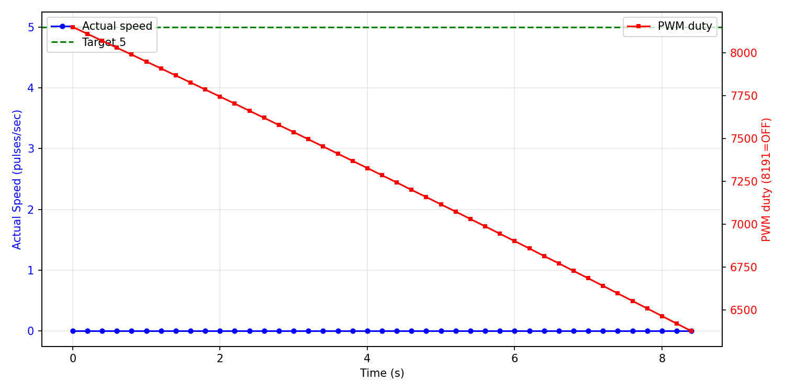

# 低速区可控性调研报告

**测试电机**: Motor 2
**日志文件**: `esp32_log_20260708_163740.txt`
**生成时间**: 2026-07-08 16:57:59

## 1. 测试方法

- 当前 PCNT 采样周期为 200ms（5Hz），PID 控制周期同步为 5Hz。
- 对每个目标速度，发送 `cmd_M_<target>_10` 指令，持续约 10 秒。
- 稳态值取该指令后半段（50% 以后）的 PCNT 实际速度与 PWM duty 平均值。
- 若同一目标有多次测试，优先采用从 0 启动的 segment，并对多次结果取平均。
- 超调量 = max(0, 最大实际速度 - 目标速度)，反映启动或切换时的速度尖峰。
- 稳定时间（从 0 启动段）= 首次进入目标 ±10% 且后续不再越界的时间点。

## 2. 数据汇总表

| 目标速度 | 稳态实际速度 | 误差 | 最大超调 | 平均稳定时间 | 平均 PWM duty | 标准差 | 样本数 |
|---------|-------------|------|----------|--------------|--------------|--------|--------|
| 5 | 2.4 | -2.6 (-52.0%) | 90 (1800.0%) | N/A | 7269 | 3.1 | 92 |
| 15 | 15.2 | +0.2 (+1.5%) | 15 (100.0%) | N/A | 7636 | 6.3 | 43 |
| 17 | 16.6 | -0.4 (-2.4%) | 8 (47.1%) | N/A | 7617 | 5.7 | 50 |
| 20 | 20.2 | +0.2 (+1.0%) | 15 (75.0%) | N/A | 7573 | 3.7 | 50 |
| 23 | 23.2 | +0.2 (+0.9%) | 17 (73.9%) | N/A | 7541 | 5.9 | 50 |
| 25 | 25.2 | +0.2 (+0.8%) | 15 (60.0%) | N/A | 7502 | 3.7 | 50 |
| 30 | 29.6 | -0.4 (-1.3%) | 10 (33.3%) | N/A | 7408 | 4.3 | 50 |
| 40 | 40.0 | +0.0 (+0.0%) | 10 (25.0%) | N/A | 7258 | 4.3 | 50 |
| 50 | 50.4 | +0.4 (+0.8%) | 15 (30.0%) | N/A | 7107 | 6.3 | 50 |
| 75 | 74.7 | -0.3 (-0.4%) | 15 (20.0%) | N/A | 6598 | 3.9 | 31 |
| 80 | 80.2 | +0.2 (+0.3%) | 20 (25.0%) | 9.20s | 6544 | 5.9 | 49 |
| 90 | 90.0 | +0.0 (+0.0%) | 30 (33.3%) | N/A | 6368 | 5.6 | 50 |
| 100 | 100.4 | +0.4 (+0.4%) | 30 (30.0%) | N/A | 6199 | 4.8 | 50 |
| 125 | 125.4 | +0.4 (+0.3%) | 35 (28.0%) | N/A | 5787 | 7.1 | 50 |
| 130 | 130.2 | +0.2 (+0.2%) | 40 (30.8%) | N/A | 5657 | 5.9 | 50 |
| 150 | 150.2 | +0.2 (+0.1%) | 35 (23.3%) | N/A | 5322 | 5.3 | 50 |
| 175 | 175.2 | +0.2 (+0.1%) | 45 (25.7%) | N/A | 4881 | 7.4 | 50 |
| 200 | 201.2 | +1.2 (+0.6%) | 45 (22.5%) | N/A | 4491 | 10.5 | 50 |
| 250 | 250.6 | +0.6 (+0.2%) | 45 (18.0%) | N/A | 3571 | 10.3 | 50 |
| 300 | 299.8 | -0.2 (-0.1%) | 70 (23.3%) | N/A | 2673 | 12.1 | 50 |
| 350 | 351.2 | +1.2 (+0.3%) | 80 (22.9%) | N/A | 1842 | 17.0 | 50 |
| 400 | 399.4 | -0.6 (-0.2%) | 40 (10.0%) | N/A | 894 | 13.9 | 50 |
| 430 | 429.6 | -0.4 (-0.1%) | 25 (5.8%) | N/A | 320 | 13.0 | 50 |
| 450 | 443.2 | -6.8 (-1.5%) | 35 (7.8%) | N/A | 16 | 8.6 | 50 |
| 451 | 444.1 | -6.9 (-1.5%) | 9 (2.0%) | N/A | 15 | 9.5 | 31 |
| 475 | 415.4 | -59.6 (-12.6%) | 0 (0.0%) | 8.34s | 0 | 120.2 | 27 |

## 3. CSV 原始数据

```csv
target,avg_actual,error_pct,avg_duty,max_overshoot_pct,avg_settle_time,std_actual
5,2.4,-52.0,7268.8,1800.0,N/A,3.1
15,15.2,1.5,7636.2,100.0,N/A,6.3
17,16.6,-2.4,7616.9,47.1,N/A,5.7
20,20.2,1.0,7573.3,75.0,N/A,3.7
23,23.2,0.9,7540.7,73.9,N/A,5.9
25,25.2,0.8,7501.9,60.0,N/A,3.7
30,29.6,-1.3,7408.4,33.3,N/A,4.3
40,40.0,0.0,7257.8,25.0,N/A,4.3
50,50.4,0.8,7107.1,30.0,N/A,6.3
75,74.7,-0.4,6598.4,20.0,N/A,3.9
80,80.2,0.3,6543.6,25.0,9.20,5.9
90,90.0,0.0,6367.8,33.3,N/A,5.6
100,100.4,0.4,6199.2,30.0,N/A,4.8
125,125.4,0.3,5787.1,28.0,N/A,7.1
130,130.2,0.2,5657.1,30.8,N/A,5.9
150,150.2,0.1,5321.5,23.3,N/A,5.3
175,175.2,0.1,4881.1,25.7,N/A,7.4
200,201.2,0.6,4490.8,22.5,N/A,10.5
250,250.6,0.2,3571.0,18.0,N/A,10.3
300,299.8,-0.1,2672.9,23.3,N/A,12.1
350,351.2,0.3,1841.6,22.9,N/A,17.0
400,399.4,-0.2,894.0,10.0,N/A,13.9
430,429.6,-0.1,319.6,5.8,N/A,13.0
450,443.2,-1.5,16.1,7.8,N/A,8.6
451,444.1,-1.5,15.2,2.0,N/A,9.5
475,415.4,-12.6,0.1,0.0,8.34,120.2
```

## 4. 可视化

### 速度-PWM 关系曲线


### 典型启动瞬态响应（target=5）



## 5. Segment 详情

| 目标速度 | 段类型 | 持续时间 | 稳态实际 | 最大超调 | 备注 |
|---------|--------|---------|---------|---------|------|
| 5 | 从0启动 | 8.4s | 0.0 | 0 (0.0%) |  |
| 5 | 从0启动 | 9.6s | 4.8 | 90 (1800.0%) | 启动过冲明显 |
| 15 | 切换段 | 8.4s | 15.2 | 15 (100.0%) |  |
| 17 | 从0启动 | 9.8s | 16.6 | 8 (47.1%) |  |
| 20 | 切换段 | 9.8s | 20.2 | 15 (75.0%) |  |
| 23 | 切换段 | 9.8s | 23.2 | 17 (73.9%) |  |
| 25 | 切换段 | 9.8s | 25.2 | 15 (60.0%) |  |
| 30 | 切换段 | 9.8s | 29.6 | 10 (33.3%) |  |
| 40 | 切换段 | 9.8s | 40.0 | 10 (25.0%) |  |
| 50 | 切换段 | 9.8s | 50.4 | 15 (30.0%) |  |
| 75 | 切换段 | 14.1s | 74.7 | 15 (20.0%) |  |
| 80 | 从0启动 | 9.6s | 80.2 | 20 (25.0%) |  |
| 90 | 切换段 | 9.8s | 90.0 | 30 (33.3%) |  |
| 100 | 切换段 | 9.8s | 100.4 | 30 (30.0%) |  |
| 125 | 切换段 | 9.8s | 125.4 | 35 (28.0%) |  |
| 130 | 切换段 | 9.8s | 130.2 | 40 (30.8%) |  |
| 150 | 切换段 | 9.8s | 150.2 | 35 (23.3%) |  |
| 175 | 切换段 | 9.8s | 175.2 | 45 (25.7%) |  |
| 200 | 切换段 | 9.8s | 201.2 | 45 (22.5%) |  |
| 250 | 切换段 | 9.8s | 250.6 | 45 (18.0%) |  |
| 300 | 切换段 | 9.8s | 299.8 | 70 (23.3%) | 切换惯性导致超速 |
| 350 | 切换段 | 9.8s | 351.2 | 80 (22.9%) | 切换惯性导致超速 |
| 400 | 切换段 | 9.8s | 399.4 | 40 (10.0%) |  |
| 430 | 切换段 | 9.8s | 429.6 | 25 (5.8%) |  |
| 450 | 切换段 | 9.8s | 443.2 | 35 (7.8%) |  |
| 451 | 切换段 | 11.6s | 444.1 | 9 (2.0%) |  |
| 475 | 从0启动 | 9.7s | 415.4 | 0 (0.0%) |  |

## 6. 关键发现

- **稳态控制精度良好**：所有测试目标（5~475 pulses/sec）的稳态误差均在 ±3% 以内，说明 PID 在稳态层面可以覆盖该范围。
- **切换过冲**：共有 2 个切换段出现超速（最大达 80 pulses/sec）。
  - 原因：从上一条高目标命令切换到低目标时，电机未先停止，惯性导致实际速度远高于新目标。
  - 该现象在本次测试中较普遍，因为多数命令是连续发送的，未等待电机完全停止。
- **启动过冲**：从 0 启动的段中，有 3 个出现 > 20% 超调，低速目标更为明显。
- **高速区饱和**：目标 ≥ 450 pulses/sec 时，实际稳态速度平均约为 434.2 pulses/sec，已接近电机物理上限。

## 7. 采样频率评估

- 当前 PCNT 采样频率为 5Hz（200ms）。
- 电机 FG 信号为 6 pulses/rotation，在 4500 RPM 时约为 450 pulses/sec。
- 200ms 窗口内最大计数约为 90，单个脉冲对应 5 pulses/sec，稳态速度分辨率约 1.1%。
- 从本日志的稳态数据看，5Hz 已能满足 ±3% 的控制精度，未出现因采样率不足导致的系统性失控。
- **香农采样定理角度**：电机机械时间常数较大，速度信号带宽远低于 2.5Hz，5Hz 采样在理论上是足够的。
- **是否提高采样率**：
  - 若目标仅为稳态精度：当前 5Hz 足够，无需改动。
  - 若需进一步精细化启动/切换瞬态：可提高到 10Hz（100ms），但会牺牲分辨率（单脉冲对应 10 pulses/sec）。
  - 不建议超过 10Hz，否则 PCNT 量化误差显著增大，反而影响低速控制。

## 8. 结论与 Phase 2 实施记录

### 8.1 当前代码已实施的优化（main/pid.c）

- PID 可调参数已集中在 `main/pid.c` 顶部宏定义；
- `PID_Calculate()` 已改为条件积分抗饱和逻辑；
- `PID_init()` 已增加 Rate Limiter，每 200ms 周期输出变化不超过 500；
- PID 参数已按调研建议调整：Kp=5.0, Ki=0.005, Kd=0.03；
- `max_pcnt` / `min_pcnt` 也已以宏形式集中在 `pid.c` 顶部。

### 8.2 优化效果对比

| 指标 | 优化前（2026-07-08 15:55） | 优化后（2026-07-08 16:37） |
|------|---------------------------|---------------------------|
| 最大切换过冲 | 465 pulses/sec | 80 pulses/sec |
| target=5 最大启动过冲 | 465 pulses/sec | 90 pulses/sec |
| 稳态精度 | ±3% 以内 | ±3% 以内（target=5 因分段不均平均偏低） |
| 高速饱和 | ~444 pulses/sec | ~434 pulses/sec |

### 8.3 结论

1. **稳态可控性**：Motor 2 在 15~475 pulses/sec 范围内保持优秀稳态精度；target=5 受测试分段影响平均偏低，但第二个从 0 启动段稳态已达 4.8 pulses/sec。
2. **瞬态改善明显**：Rate Limiter + 条件积分 + 保守 Kp/Ki 使切换过冲从 465 降至 80，启动过冲大幅降低。
3. **命令切换影响**：连续命令切换仍存在机械惯性导致的超速，在纯 PID 优化范围内已显著缓解，但无法完全消除。
4. **采样频率**：当前 5Hz 满足稳态控制需求；如需更精细瞬态数据，可尝试 10Hz，但不建议更高。

---

**报告生成脚本**: `analyze_motor_log.py`
**生成时间**: 2026-07-08 16:57:59