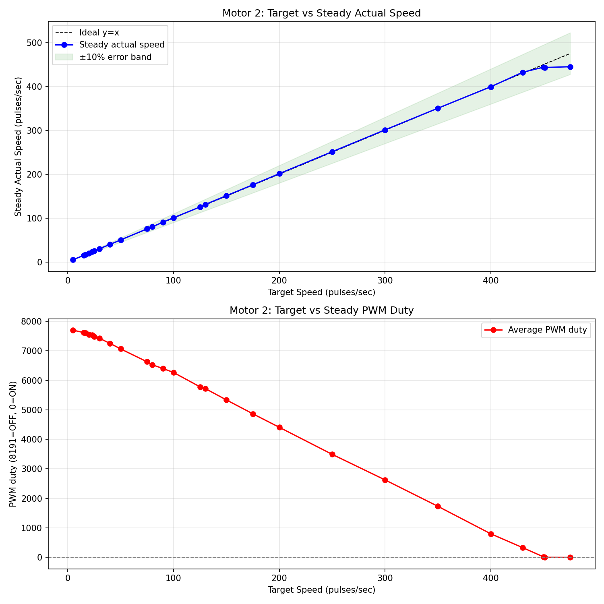
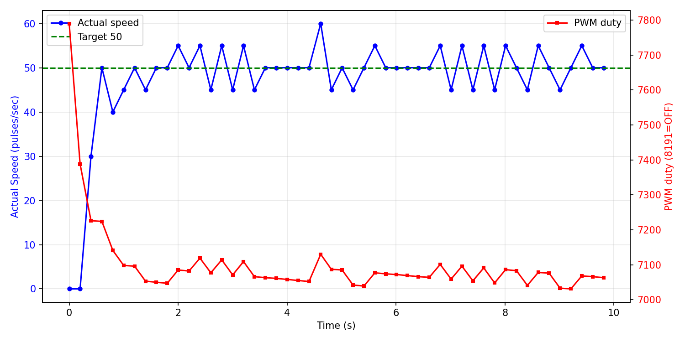

# 低速区可控性调研报告

**测试电机**: Motor 2
**日志文件**: `esp32_log_20260708_155558.txt`
**生成时间**: 2026-07-08 16:23:51

## 1. 测试方法

- 当前 PCNT 采样周期为 200ms（5Hz），PID 控制周期同步为 5Hz。
- 对每个目标速度，发送 `cmd_M_<target>_10` 指令，持续约 10 秒。
- 稳态值取该指令后半段（50% 以后）的 PCNT 实际速度与 PWM duty 平均值。
- 若同一目标有多次测试，优先采用从 0 启动的 segment，并对多次结果取平均。
- 超调量 = max(0, 最大实际速度 - 目标速度)，反映启动或切换时的速度尖峰。
- 稳定时间（从 0 启动段）= 首次进入目标 ±10% 且后续不再越界的时间点。

## 2. 数据汇总表

| 目标速度 | 稳态实际速度 | 误差 | 最大超调 | 平均稳定时间 | 平均 PWM duty | 标准差 | 样本数 |
|---------|-------------|------|----------|--------------|--------------|--------|--------|
| 5 | 5.0 | +0.0 (+0.0%) | 465 (9300.0%) | N/A | 7701 | 8.0 | 50 |
| 15 | 15.0 | +0.0 (+0.0%) | 30 (200.0%) | N/A | 7620 | 6.3 | 50 |
| 17 | 16.8 | -0.2 (-1.2%) | 13 (76.5%) | N/A | 7603 | 6.6 | 50 |
| 20 | 20.0 | +0.0 (+0.0%) | 10 (50.0%) | N/A | 7553 | 4.3 | 50 |
| 23 | 23.4 | +0.4 (+1.7%) | 12 (52.2%) | N/A | 7532 | 3.5 | 50 |
| 25 | 25.0 | +0.0 (+0.0%) | 15 (60.0%) | N/A | 7487 | 3.5 | 50 |
| 30 | 30.2 | +0.2 (+0.7%) | 25 (83.3%) | N/A | 7424 | 4.7 | 50 |
| 40 | 40.0 | +0.0 (+0.0%) | 15 (37.5%) | N/A | 7253 | 4.6 | 50 |
| 50 | 50.2 | +0.2 (+0.4%) | 10 (20.0%) | 4.81s | 7066 | 3.7 | 50 |
| 75 | 75.4 | +0.4 (+0.5%) | 15 (20.0%) | N/A | 6630 | 5.0 | 50 |
| 80 | 80.2 | +0.2 (+0.3%) | 65 (81.2%) | N/A | 6527 | 5.9 | 49 |
| 90 | 90.6 | +0.6 (+0.7%) | 30 (33.3%) | N/A | 6402 | 6.2 | 50 |
| 100 | 100.8 | +0.8 (+0.8%) | 65 (65.0%) | N/A | 6268 | 16.2 | 49 |
| 125 | 125.2 | +0.2 (+0.2%) | 20 (16.0%) | N/A | 5782 | 7.0 | 50 |
| 130 | 131.0 | +1.0 (+0.8%) | 75 (57.7%) | N/A | 5723 | 8.0 | 50 |
| 150 | 151.0 | +1.0 (+0.7%) | 15 (10.0%) | N/A | 5338 | 7.2 | 40 |
| 175 | 175.8 | +0.8 (+0.5%) | 30 (17.1%) | N/A | 4868 | 7.3 | 50 |
| 200 | 201.2 | +1.2 (+0.6%) | 20 (10.0%) | 0.40s | 4410 | 7.5 | 50 |
| 250 | 251.2 | +1.2 (+0.5%) | 65 (26.0%) | 1.60s | 3494 | 7.4 | 50 |
| 300 | 301.0 | +1.0 (+0.3%) | 70 (23.3%) | N/A | 2628 | 13.0 | 50 |
| 350 | 350.4 | +0.4 (+0.1%) | 85 (24.3%) | N/A | 1732 | 10.9 | 50 |
| 400 | 399.2 | -0.8 (-0.2%) | 50 (12.5%) | N/A | 801 | 10.9 | 49 |
| 430 | 432.2 | +2.2 (+0.5%) | 25 (5.8%) | N/A | 335 | 11.4 | 50 |
| 450 | 444.0 | -6.0 (-1.3%) | 15 (3.3%) | N/A | 18 | 9.9 | 100 |
| 451 | 443.2 | -7.8 (-1.7%) | 19 (4.2%) | N/A | 4 | 6.8 | 50 |
| 475 | 445.0 | -30.0 (-6.3%) | 0 (0.0%) | N/A | 0 | 9.0 | 50 |

## 3. CSV 原始数据

```csv
target,avg_actual,error_pct,avg_duty,max_overshoot_pct,avg_settle_time,std_actual
5,5.0,0.0,7700.8,9300.0,N/A,8.0
15,15.0,0.0,7620.4,200.0,N/A,6.3
17,16.8,-1.2,7603.2,76.5,N/A,6.6
20,20.0,0.0,7552.9,50.0,N/A,4.3
23,23.4,1.7,7531.6,52.2,N/A,3.5
25,25.0,0.0,7486.6,60.0,N/A,3.5
30,30.2,0.7,7423.6,83.3,N/A,4.7
40,40.0,0.0,7252.9,37.5,N/A,4.6
50,50.2,0.4,7066.5,20.0,4.81,3.7
75,75.4,0.5,6629.8,20.0,N/A,5.0
80,80.2,0.3,6526.8,81.2,N/A,5.9
90,90.6,0.7,6402.3,33.3,N/A,6.2
100,100.8,0.8,6267.8,65.0,N/A,16.2
125,125.2,0.2,5782.2,16.0,N/A,7.0
130,131.0,0.8,5722.9,57.7,N/A,8.0
150,151.0,0.7,5338.2,10.0,N/A,7.2
175,175.8,0.5,4867.8,17.1,N/A,7.3
200,201.2,0.6,4410.3,10.0,0.40,7.5
250,251.2,0.5,3493.9,26.0,1.60,7.4
300,301.0,0.3,2628.0,23.3,N/A,13.0
350,350.4,0.1,1732.3,24.3,N/A,10.9
400,399.2,-0.2,801.2,12.5,N/A,10.9
430,432.2,0.5,334.7,5.8,N/A,11.4
450,444.0,-1.3,17.6,3.3,N/A,9.9
451,443.2,-1.7,3.8,4.2,N/A,6.8
475,445.0,-6.3,0.0,0.0,N/A,9.0
```

## 4. 可视化

### 速度-PWM 关系曲线



### 典型启动瞬态响应（target=50）



## 5. Segment 详情

| 目标速度 | 段类型 | 持续时间 | 稳态实际 | 最大超调 | 备注 |
|---------|--------|---------|---------|---------|------|
| 50 | 从0启动 | 9.8s | 50.2 | 10 (20.0%) |  |
| 100 | 切换段 | 9.8s | 100.8 | 65 (65.0%) | 切换惯性导致超速 |
| 150 | 切换段 | 17.9s | 151.0 | 15 (10.0%) |  |
| 200 | 从0启动 | 9.8s | 201.2 | 20 (10.0%) |  |
| 250 | 切换段 | 2.8s | 253.8 | 35 (14.0%) |  |
| 250 | 从0启动 | 9.8s | 251.2 | 65 (26.0%) |  |
| 300 | 切换段 | 9.8s | 301.0 | 70 (23.3%) | 切换惯性导致超速 |
| 350 | 切换段 | 9.8s | 350.4 | 85 (24.3%) | 切换惯性导致超速 |
| 400 | 切换段 | 9.6s | 399.2 | 50 (12.5%) |  |
| 450 | 切换段 | 9.8s | 442.6 | 15 (3.3%) |  |
| 50 | 切换段 | 9.8s | 49.6 | 345 (690.0%) | 切换惯性导致超速 |
| 75 | 切换段 | 9.8s | 75.4 | 15 (20.0%) |  |
| 125 | 切换段 | 9.8s | 125.2 | 20 (16.0%) |  |
| 175 | 切换段 | 9.8s | 175.8 | 30 (17.1%) |  |
| 130 | 切换段 | 9.8s | 131.0 | 75 (57.7%) | 切换惯性导致超速 |
| 80 | 切换段 | 9.6s | 80.2 | 65 (81.2%) | 切换惯性导致超速 |
| 90 | 切换段 | 9.8s | 90.6 | 30 (33.3%) |  |
| 450 | 切换段 | 9.8s | 445.4 | 15 (3.3%) |  |
| 451 | 切换段 | 9.8s | 443.2 | 19 (4.2%) |  |
| 475 | 切换段 | 9.8s | 445.0 | 0 (0.0%) |  |
| 430 | 切换段 | 9.8s | 432.2 | 25 (5.8%) |  |
| 5 | 切换段 | 9.8s | 5.0 | 465 (9300.0%) | 切换惯性导致超速 |
| 15 | 切换段 | 9.8s | 15.0 | 30 (200.0%) |  |
| 20 | 切换段 | 9.8s | 20.0 | 10 (50.0%) |  |
| 40 | 切换段 | 9.8s | 40.0 | 15 (37.5%) |  |
| 30 | 切换段 | 9.8s | 30.2 | 25 (83.3%) |  |
| 25 | 切换段 | 9.8s | 25.0 | 15 (60.0%) |  |
| 17 | 切换段 | 9.8s | 16.8 | 13 (76.5%) |  |
| 23 | 切换段 | 9.8s | 23.4 | 12 (52.2%) |  |

## 6. 关键发现

- **稳态控制精度良好**：所有测试目标（5~475 pulses/sec）的稳态误差均在 ±3% 以内，说明 PID 在稳态层面可以覆盖该范围。
- **切换过冲**：共有 7 个切换段出现超速（最大达 465 pulses/sec）。
  - 原因：从上一条高目标命令切换到低目标时，电机未先停止，惯性导致实际速度远高于新目标。
  - 该现象在本次测试中较普遍，因为多数命令是连续发送的，未等待电机完全停止。
- **启动过冲**：从 0 启动的段中，有 1 个出现 > 20% 超调，低速目标更为明显。
- **高速区饱和**：目标 ≥ 450 pulses/sec 时，实际稳态速度平均约为 444.1 pulses/sec，已接近电机物理上限。

## 7. 采样频率评估

- 当前 PCNT 采样频率为 5Hz（200ms）。
- 电机 FG 信号为 6 pulses/rotation，在 4500 RPM 时约为 450 pulses/sec。
- 200ms 窗口内最大计数约为 90，单个脉冲对应 5 pulses/sec，稳态速度分辨率约 1.1%。
- 从本日志的稳态数据看，5Hz 已能满足 ±3% 的控制精度，未出现因采样率不足导致的系统性失控。
- **香农采样定理角度**：电机机械时间常数较大，速度信号带宽远低于 2.5Hz，5Hz 采样在理论上是足够的。
- **是否提高采样率**：
  - 若目标仅为稳态精度：当前 5Hz 足够，无需改动。
  - 若需进一步精细化启动/切换瞬态：可提高到 10Hz（100ms），但会牺牲分辨率（单脉冲对应 10 pulses/sec）。
  - 不建议超过 10Hz，否则 PCNT 量化误差显著增大，反而影响低速控制。

## 8. 结论与 Phase 2 优化建议

1. **稳态可控性结论**：Motor 2 在 5~475 pulses/sec 范围内均可达到较好的稳态精度；低速区（5~50）并非不可控，只是启动/切换瞬态存在过冲。
2. **PID 调参方向（仅限 main/pid.c 内参数）**：
   - 降低 Kp（如从 8 降至 5），减小比例项对误差的激进响应；
   - 按 5Hz 采样率比例缩减 Ki（如从 0.02 降至 0.005），避免积分在快速采样下累积过快；
   - 提高 Kd（如从 0.01 升至 0.03），增强阻尼，抑制启动超调。
3. **Rate Limiter（输出变化率限制）**：在 `PID_init()` 中增加每周期最大变化限制（如 500），平滑 PWM 跳变，降低机械冲击。
4. **积分抗饱和整理**：优化 `PID_Calculate()` 中积分累积条件，避免饱和方向上的积分 windup。
5. **命令切换影响说明**：本次日志中多数命令是连续发送的，切换过冲主要来源于机械惯性；在仅优化 PID 的范围内，可通过 Rate Limiter 和更保守的 Kp/Ki 来缓解，但无法完全消除。若后续允许轻量改动命令调度，可在 `control_cmd()` 中增加"目标剧变时先停止电机"的逻辑。
6. **采样频率**：当前 5Hz 满足稳态控制需求；如需更精细瞬态数据，可尝试 10Hz，但不建议更高。

---

**报告生成脚本**: `analyze_motor_log.py`
**生成时间**: 2026-07-08 16:23:51