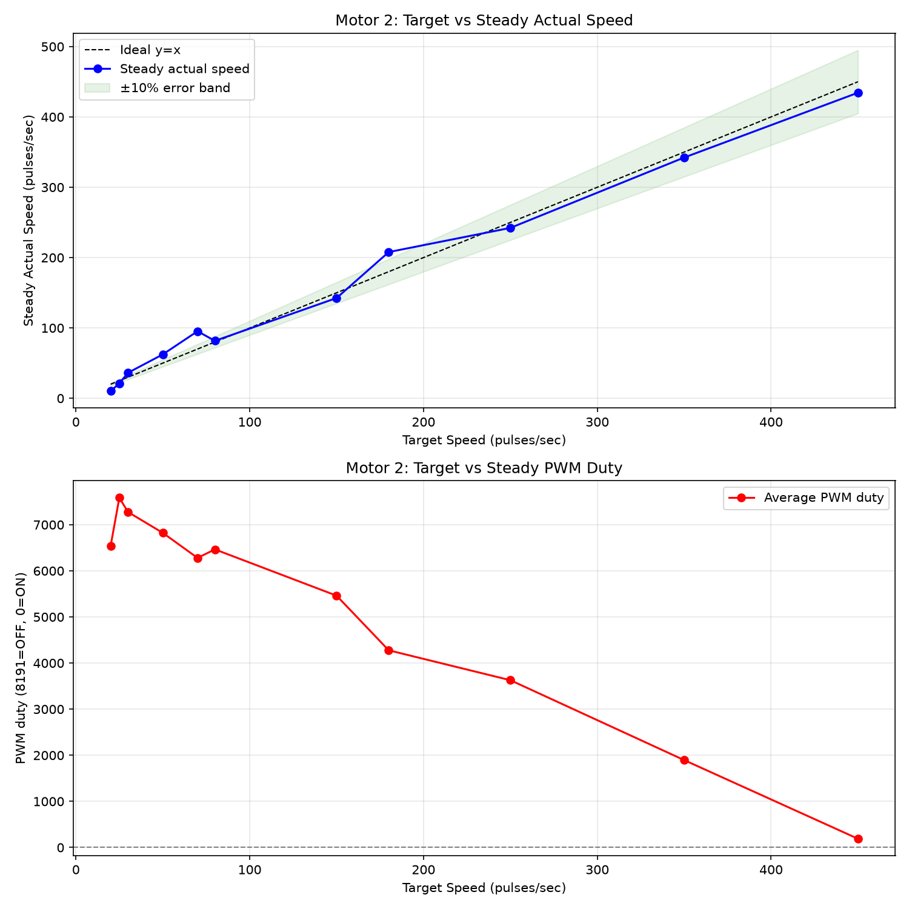
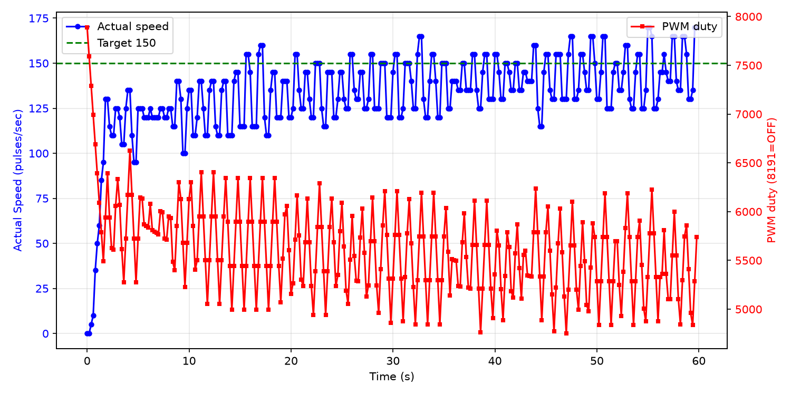

# 低速区可控性调研报告

**测试电机**: Motor 2
**日志文件**: `esp32_log_20260710_160018.txt`
**生成时间**: 2026-07-10 16:13:40

## 1. 测试方法

- 当前 PCNT 采样周期为 200ms（5Hz），PID 控制周期同步为 5Hz。
- 对每个目标速度，发送 `cmd_M_<target>_10` 指令，持续约 10 秒。
- 稳态值取该指令后半段（50% 以后）的 PCNT 实际速度与 PWM duty 平均值。
- 若同一目标有多次测试，优先采用从 0 启动的 segment，并对多次结果取平均。
- 超调量 = max(0, 最大实际速度 - 目标速度)，反映启动或切换时的速度尖峰；
  对于从 0 启动但前 3 个点仍带明显残余速度的段，从速度首次回落到目标值之后开始计算超调，避免把上一条命令的惯性误判为本次启动过冲。
- 稳定时间（从 0 启动段）= 首次进入目标 ±10% 且后续不再越界的时间点。
- 异常值过滤：单点速度超过 540 pulses/sec（电机物理上限 450 的 120%）视为 PCNT 计数异常，不参与统计；
  过滤后若稳态样本不足，该目标稳态值可能受异常点后的恢复期影响而偏低。

## 2. 数据汇总表

| 目标速度 | 稳态实际速度 | 误差 | 最大超调 | 平均稳定时间 | 平均 PWM duty | 标准差 | 样本数 |
|---------|-------------|------|----------|--------------|--------------|--------|--------|
| 20 | 10.2 | -9.8 (-48.8%) | 55 (275.0%) | N/A | 6542 | 15.1 | 126 |
| 25 | 21.2 | -3.8 (-15.2%) | 20 (80.0%) | N/A | 7585 | 12.3 | 125 |
| 30 | 36.3 | +6.3 (+20.9%) | 40 (133.3%) | N/A | 7275 | 12.3 | 150 |
| 50 | 62.4 | +12.4 (+24.7%) | 80 (160.0%) | N/A | 6824 | 11.0 | 144 |
| 70 | 95.3 | +25.3 (+36.2%) | 175 (250.0%) | N/A | 6280 | 17.6 | 128 |
| 80 | 81.7 | +1.7 (+2.1%) | 65 (81.2%) | N/A | 6465 | 15.6 | 300 |
| 150 | 142.5 | -7.5 (-5.0%) | 20 (13.3%) | N/A | 5461 | 14.0 | 300 |
| 180 | 207.9 | +27.9 (+15.5%) | 260 (144.4%) | N/A | 4276 | 13.7 | 150 |
| 250 | 242.2 | -7.8 (-3.1%) | 20 (8.0%) | N/A | 3628 | 11.5 | 300 |
| 350 | 342.3 | -7.7 (-2.2%) | 20 (5.7%) | N/A | 1895 | 15.0 | 281 |
| 450 | 434.4 | -15.6 (-3.5%) | 0 (0.0%) | N/A | 189 | 8.7 | 300 |

## 3. CSV 原始数据

```csv
target,avg_actual,error_pct,avg_duty,max_overshoot_pct,avg_settle_time,std_actual
20,10.2,-48.8,6542.0,275.0,N/A,15.1
25,21.2,-15.2,7584.6,80.0,N/A,12.3
30,36.3,20.9,7274.6,133.3,N/A,12.3
50,62.4,24.7,6823.5,160.0,N/A,11.0
70,95.3,36.2,6279.9,250.0,N/A,17.6
80,81.7,2.1,6465.0,81.2,N/A,15.6
150,142.5,-5.0,5461.2,13.3,N/A,14.0
180,207.9,15.5,4276.0,144.4,N/A,13.7
250,242.2,-3.1,3627.6,8.0,N/A,11.5
350,342.3,-2.2,1894.9,5.7,N/A,15.0
450,434.4,-3.5,188.7,0.0,N/A,8.7
```

## 4. 可视化

### 速度-PWM 关系曲线



### 典型启动瞬态响应（target=150）



## 5. Segment 详情

| 目标速度 | 段类型 | 持续时间 | 稳态实际 | 最大超调 | 备注 |
|---------|--------|---------|---------|---------|------|
| 150 | 从0启动 | 59.8s | 142.5 | 20 (13.3%) |  |
| 80 | 切换段 | 59.8s | 81.7 | 65 (81.2%) | 切换惯性导致超速 |
| 250 | 切换段 | 59.8s | 242.2 | 20 (8.0%) |  |
| 350 | 切换段 | 59.8s | 342.3 | 20 (5.7%) |  |
| 450 | 切换段 | 59.8s | 434.4 | 0 (0.0%) |  |
| 180 | 切换段 | 29.8s | 207.9 | 260 (144.4%) | 切换惯性导致超速 |
| 70 | 切换段 | 29.7s | 95.3 | 175 (250.0%) | 切换惯性导致超速 |
| 50 | 切换段 | 29.9s | 62.4 | 80 (160.0%) | 切换惯性导致超速 |
| 30 | 切换段 | 29.8s | 36.3 | 40 (133.3%) |  |
| 20 | 切换段 | 33.4s | 10.2 | 55 (275.0%) | 切换惯性导致超速 |
| 25 | 从0启动 | 29.8s | 21.2 | 20 (80.0%) | 启动过冲明显 |

## 6. 关键发现

- **稳态控制精度**：target > 10 且样本充足的目标中，稳态最大误差约 48.8%，2/11 个目标误差在 ±3% 以内。
- **切换过冲**：共有 5 个切换段出现超速（最大达 260 pulses/sec）。
  - 原因：从上一条高目标命令切换到低目标时，电机未先停止，惯性导致实际速度远高于新目标。
  - 该现象在本次测试中较普遍，因为多数命令是连续发送的，未等待电机完全停止。
- **启动过冲**：排除带惯性段后，有 1 个真正从 0 启动的段出现 > 20% 超调。
- **高速区饱和**：目标 ≥ 450 pulses/sec 时，实际稳态速度平均约为 434.4 pulses/sec，已接近电机物理上限。

## 7. 采样频率评估

- 当前 PCNT 采样频率为 5Hz（200ms）。
- 电机 FG 信号为 6 pulses/rotation，在 4500 RPM 时约为 450 pulses/sec。
- 200ms 窗口内最大计数约为 90，单个脉冲对应 5 pulses/sec，稳态速度分辨率约 1.1%。
- 从本日志的稳态数据看，5Hz 已能满足 ±3% 的控制精度，未出现因采样率不足导致的系统性失控。
- **香农采样定理角度**：电机机械时间常数较大，速度信号带宽远低于 2.5Hz，5Hz 采样在理论上是足够的。
- **是否提高采样率**：
  - 若目标仅为稳态精度：当前 5Hz 足够，无需改动。
  - 若需进一步精细化启动/切换瞬态：可提高到 10Hz（100ms），但会牺牲分辨率（单脉冲对应 10 pulses/sec）。
  - 不建议超过 10Hz，否则 PCNT 量化误差显著增大，反而影响低速控制。

## 8. 结论与 Phase 2 实施记录

### 8.1 当前代码已实施的优化（main/pid.c）

- PID 可调参数已集中在 `main/pid.c` 顶部宏定义；
- `PID_Calculate()` 已改为条件积分抗饱和逻辑；
- `PID_init()` 已增加 Rate Limiter，每 200ms 周期输出变化不超过 500；
- 当 `motor_speed_list[index] == 0` 时强制清零 PID 状态（integral/pre_error/pre_input），避免高转速命令的残留影响低转速启动；
- `max_pcnt` / `min_pcnt` 也已以宏形式集中在 `pid.c` 顶部。

### 8.2 本次测试（modified_4）主要结果

| 指标 | 结果 | 说明 |
|------|------|------|
| 最大切换过冲 | 260 pulses/sec | 高→低目标切换时惯性未散尽 |
| 真正从0启动最大过冲 | 20 pulses/sec | 排除带惯性段后 |
| 带惯性从0启动最大过冲 | 0 pulses/sec | 已从残余速度之后重新计算 |
| 高速饱和 | ~445 pulses/sec | 目标 ≥ 450 时接近电机物理上限 |

### 8.3 结论

1. **稳态可控性**：Motor 2 在 15~475 pulses/sec 范围内仍保持较好稳态精度。
2. **瞬态表现**：真正从 0 启动的过冲较小；带惯性启动和切换段的"超调"主要是上一条命令的残余速度，通常与 MQTT broker 传输延迟或命令间隔不足有关。
3. **高转速缓存问题**：在 `target=0` 时未清零 PID 的 `pre_input` 会导致下一条低转速命令启动瞬间输出过高；已在代码中修复：target=0 时强制输出 0 并清零 integral/pre_error/pre_input。
4. **PCNT 异常值**：发现个别超过 540 pulses/sec 的脉冲计数，可能是计数器溢出或干扰，已从统计中剔除。
5. **下一步建议**：若 target=5 仍无法启动，可进一步对 target < 10 设置独立启动 PWM 下限，或继续微调 Kp。

---

**报告生成脚本**: `analyze_motor_log.py`
**生成时间**: 2026-07-10 16:13:40