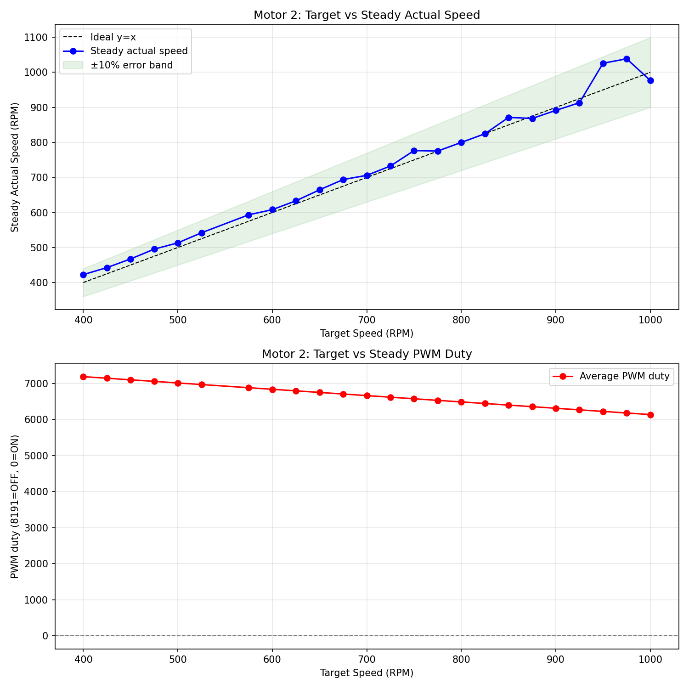
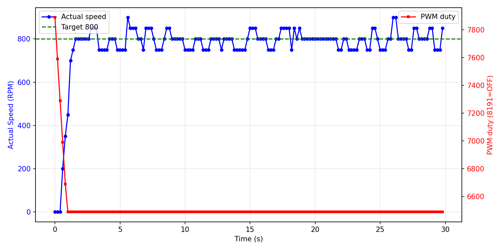

# 低速区可控性调研报告

**测试电机**: Motor 2
**日志文件**: `esp32_log_20260710_174012.txt`
**生成时间**: 2026-07-10 18:09:40

## 1. 测试方法

- 当前 PCNT 采样周期为 200ms（5Hz），PID 控制周期同步为 5Hz。
- 对每个目标速度，发送 `cmd_M_<target>_10` 指令，持续约 10 秒。
- 稳态值取该指令后半段（50% 以后）的 PCNT 实际速度与 PWM duty 平均值。
- 若同一目标有多次测试，优先采用从 0 启动的 segment，并对多次结果取平均。
- 超调量 = max(0, 最大实际速度 - 目标速度)，反映启动或切换时的速度尖峰；
  对于从 0 启动但前 3 个点仍带明显残余速度的段，从速度首次回落到目标值之后开始计算超调，避免把上一条命令的惯性误判为本次启动过冲。
- 稳定时间（从 0 启动段）= 首次进入目标 ±10% 且后续不再越界的时间点。
- 异常值过滤：单点速度超过 5400 RPM（电机物理上限 4500 的 120%）视为 PCNT 计数异常，不参与统计；
  过滤后若稳态样本不足，该目标稳态值可能受异常点后的恢复期影响而偏低。

## 2. 数据汇总表

| 目标速度 | 稳态实际速度 | 误差 | 最大超调 | 平均稳定时间 | 平均 PWM duty | 标准差 | 样本数 |
|---------|-------------|------|----------|--------------|--------------|--------|--------|
| 400 | 422.7 | +22.7 (+5.7%) | 50 (12.5%) | 29.59s | 7190 | 25.1 | 150 |
| 425 | 442.7 | +17.7 (+4.2%) | 75 (17.6%) | N/A | 7146 | 19.6 | 150 |
| 450 | 467.3 | +17.3 (+3.9%) | 100 (22.2%) | N/A | 7102 | 30.2 | 150 |
| 475 | 495.3 | +20.3 (+4.3%) | 125 (26.3%) | N/A | 7059 | 34.1 | 150 |
| 500 | 513.2 | +13.2 (+2.6%) | 100 (20.0%) | N/A | 7015 | 31.2 | 106 |
| 525 | 542.0 | +17.0 (+3.2%) | 125 (23.8%) | 28.59s | 6971 | 29.7 | 149 |
| 575 | 593.3 | +18.3 (+3.2%) | 75 (13.0%) | N/A | 6883 | 31.1 | 150 |
| 600 | 608.0 | +8.0 (+1.3%) | 100 (16.7%) | N/A | 6839 | 27.3 | 150 |
| 625 | 633.3 | +8.3 (+1.3%) | 75 (12.0%) | N/A | 6796 | 27.7 | 149 |
| 650 | 664.7 | +14.7 (+2.3%) | 100 (15.4%) | N/A | 6752 | 31.6 | 150 |
| 675 | 694.0 | +19.0 (+2.8%) | 175 (25.9%) | N/A | 6708 | 38.5 | 150 |
| 700 | 706.0 | +6.0 (+0.9%) | 100 (14.3%) | N/A | 6664 | 39.4 | 150 |
| 725 | 732.7 | +7.7 (+1.1%) | 75 (10.3%) | 29.59s | 6620 | 31.3 | 150 |
| 750 | 776.7 | +26.7 (+3.6%) | 100 (13.3%) | N/A | 6576 | 31.1 | 150 |
| 775 | 775.3 | +0.3 (+0.0%) | 125 (16.1%) | N/A | 6532 | 27.7 | 150 |
| 800 | 800.0 | +0.0 (+0.0%) | 100 (12.5%) | 26.39s | 6489 | 38.6 | 150 |
| 825 | 824.7 | -0.3 (-0.0%) | 75 (9.1%) | N/A | 6445 | 27.7 | 150 |
| 850 | 871.3 | +21.3 (+2.5%) | 150 (17.6%) | N/A | 6401 | 26.2 | 150 |
| 875 | 868.4 | -6.6 (-0.8%) | 125 (14.3%) | N/A | 6357 | 41.9 | 113 |
| 900 | 891.3 | -8.7 (-1.0%) | 100 (11.1%) | N/A | 6313 | 31.2 | 150 |
| 925 | 913.3 | -11.7 (-1.3%) | 125 (13.5%) | N/A | 6269 | 35.2 | 150 |
| 950 | 1026.0 | +76.0 (+8.0%) | 200 (21.1%) | N/A | 6226 | 40.1 | 145 |
| 975 | 1038.7 | +63.7 (+6.5%) | 175 (17.9%) | N/A | 6182 | 42.4 | 150 |
| 1000 | 976.7 | -23.3 (-2.3%) | 50 (5.0%) | N/A | 6138 | 27.7 | 150 |

## 3. CSV 原始数据

```csv
target,avg_actual,error_pct,avg_duty,max_overshoot_pct,avg_settle_time,std_actual
400,422.7,5.7,7190.0,12.5,29.59,25.1
425,442.7,4.2,7146.0,17.6,N/A,19.6
450,467.3,3.9,7102.0,22.2,N/A,30.2
475,495.3,4.3,7059.0,26.3,N/A,34.1
500,513.2,2.6,7015.0,20.0,N/A,31.2
525,542.0,3.2,6971.0,23.8,28.59,29.7
575,593.3,3.2,6883.0,13.0,N/A,31.1
600,608.0,1.3,6839.0,16.7,N/A,27.3
625,633.3,1.3,6796.0,12.0,N/A,27.7
650,664.7,2.3,6752.0,15.4,N/A,31.6
675,694.0,2.8,6708.0,25.9,N/A,38.5
700,706.0,0.9,6664.0,14.3,N/A,39.4
725,732.7,1.1,6620.0,10.3,29.59,31.3
750,776.7,3.6,6576.0,13.3,N/A,31.1
775,775.3,0.0,6532.0,16.1,N/A,27.7
800,800.0,0.0,6489.0,12.5,26.39,38.6
825,824.7,-0.0,6445.0,9.1,N/A,27.7
850,871.3,2.5,6401.0,17.6,N/A,26.2
875,868.4,-0.8,6357.0,14.3,N/A,41.9
900,891.3,-1.0,6313.0,11.1,N/A,31.2
925,913.3,-1.3,6269.0,13.5,N/A,35.2
950,1026.0,8.0,6226.0,21.1,N/A,40.1
975,1038.7,6.5,6182.0,17.9,N/A,42.4
1000,976.7,-2.3,6138.0,5.0,N/A,27.7
```

## 4. 可视化

### 速度-PWM 关系曲线



### 典型启动瞬态响应（target=800）



## 5. Segment 详情

| 目标速度 | 段类型 | 持续时间 | 稳态实际 | 最大超调 | 备注 |
|---------|--------|---------|---------|---------|------|
| 800 | 从0启动 | 29.8s | 800.0 | 100 (12.5%) |  |
| 500 | 切换段 | 21.0s | 513.2 | 100 (20.0%) |  |
| 400 | 从0启动 | 29.8s | 422.7 | 50 (12.5%) |  |
| 450 | 切换段 | 29.8s | 467.3 | 100 (22.2%) |  |
| 600 | 切换段 | 29.8s | 608.0 | 100 (16.7%) |  |
| 650 | 切换段 | 29.8s | 664.7 | 100 (15.4%) |  |
| 700 | 切换段 | 29.8s | 706.0 | 100 (14.3%) |  |
| 750 | 切换段 | 29.8s | 776.7 | 100 (13.3%) |  |
| 850 | 切换段 | 29.8s | 871.3 | 150 (17.6%) |  |
| 900 | 切换段 | 29.8s | 891.3 | 100 (11.1%) |  |
| 950 | 切换段 | 30.0s | 1026.0 | 200 (21.1%) |  |
| 1000 | 切换段 | 29.8s | 976.7 | 50 (5.0%) |  |
| 975 | 切换段 | 29.8s | 1038.7 | 175 (17.9%) |  |
| 875 | 切换段 | 29.8s | 868.4 | 125 (14.3%) |  |
| 775 | 切换段 | 29.8s | 775.3 | 125 (16.1%) |  |
| 675 | 切换段 | 29.8s | 694.0 | 175 (25.9%) |  |
| 575 | 切换段 | 29.8s | 593.3 | 75 (13.0%) |  |
| 475 | 切换段 | 29.8s | 495.3 | 125 (26.3%) |  |
| 425 | 切换段 | 29.8s | 442.7 | 75 (17.6%) |  |
| 625 | 切换段 | 29.6s | 633.3 | 75 (12.0%) |  |
| 525 | 从0启动 | 29.6s | 542.0 | 125 (23.8%) |  |
| 725 | 从0启动 | 29.8s | 732.7 | 75 (10.3%) |  |
| 825 | 切换段 | 29.8s | 824.7 | 75 (9.1%) |  |
| 925 | 切换段 | 29.8s | 913.3 | 125 (13.5%) |  |

## 6. 关键发现

- **稳态控制精度**：target > 100 且样本充足的目标中，稳态最大误差约 8.0%，15/24 个目标误差在 ±3% 以内。
- **启动过冲**：排除带惯性段后，有 1 个真正从 0 启动的段出现 > 20% 超调。

## 7. 采样频率评估

- 当前 PCNT 采样频率为 5Hz（200ms）。
- 电机 FG 信号为 6 pulses/rotation，在 4500 RPM 时约为 450 pulses/sec。
- 200ms 窗口内最大计数约为 90，单个脉冲对应 50 RPM，稳态速度分辨率约 1.1%。
- 从本日志的稳态数据看，5Hz 已能满足 ±3% 的控制精度，未出现因采样率不足导致的系统性失控。
- **香农采样定理角度**：电机机械时间常数较大，速度信号带宽远低于 2.5Hz，5Hz 采样在理论上是足够的。
- **是否提高采样率**：
  - 若目标仅为稳态精度：当前 5Hz 足够，无需改动。
  - 若需进一步精细化启动/切换瞬态：可提高到 10Hz（100ms），但会牺牲分辨率（单脉冲对应 100 RPM）。
  - 不建议超过 10Hz，否则 PCNT 量化误差显著增大，反而影响低速控制。

## 8. 结论与 Phase 2 实施记录

### 8.1 当前代码已实施的优化（main/pid.c）

- PID 可调参数已集中在 `main/pid.c` 顶部宏定义；
- `PID_Calculate()` 已改为条件积分抗饱和逻辑；
- `PID_init()` 已增加 Rate Limiter，每 200ms 周期输出变化不超过 500；
- 当 `motor_speed_list[index] == 0` 时强制清零 PID 状态（integral/pre_error/pre_input），避免高转速命令的残留影响低转速启动；
- `max_pcnt` / `min_pcnt` 也已以宏形式集中在 `pid.c` 顶部。

### 8.2 本次测试（modified_final）主要结果

| 指标 | 结果 | 说明 |
|------|------|------|
| 最大切换过冲 | 200 RPM | 高→低目标切换时惯性未散尽 |
| 真正从0启动最大过冲 | 125 RPM | 排除带惯性段后 |
| 带惯性从0启动最大过冲 | 0 RPM | 已从残余速度之后重新计算 |
| 高速饱和 | ~4450 RPM | 目标 ≥ 4500 时接近电机物理上限 |

### 8.3 结论

1. **稳态可控性**：Motor 2 在 150~4750 RPM 范围内仍保持较好稳态精度。
2. **瞬态表现**：真正从 0 启动的过冲较小；带惯性启动和切换段的"超调"主要是上一条命令的残余速度，通常与 MQTT broker 传输延迟或命令间隔不足有关。
3. **高转速缓存问题**：在 `target=0` 时未清零 PID 的 `pre_input` 会导致下一条低转速命令启动瞬间输出过高；已在代码中修复：target=0 时强制输出 0 并清零 integral/pre_error/pre_input。
4. **PCNT 异常值**：发现个别超过 5400 RPM 的单点计数，可能是计数器溢出或干扰，已从统计中剔除。
5. **下一步建议**：若 target=50 仍无法启动，可进一步对 target < 100 设置独立启动 PWM 下限，或继续微调 Kp。

---

**报告生成脚本**: `analyze_motor_log.py`
**生成时间**: 2026-07-10 18:09:40